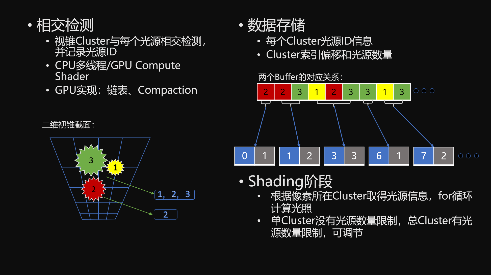

# 简介
早期主机平台为了支持多光源并且解决带宽问题，使用了*Tiled Deferred Shading*，而*Cluster Shading*更高效。

## Tiled Shading
*Tiled Shading*在屏幕空间中进行采样，在每个tile里使用里面的MinZ、MaxZ来定义子视锥体。在深度不连续的情况下（MinZ，MaxZ相距太远）会有很多计算浪费，就是因为是基于二维的分块，剔除不够精确，才导致很多性能浪费。

## Cluster Shading
*Cluster Shading*使用更高维的分块，也就是三维，这样一些Empty Space可以被剔除，剔除的精度肯定会更高，这样在Shading的时候会节省很多性能。如果有法线信息那么还可以进行背面的光照计算剔除，但是Forward Shading中，最多只能获取深度信息，所以背面剔除可以暂时不考虑。

这里*Cluster Shading*算法主要包括下面几个部分：
* Render scene to G-Buffers
* Cluster assignment
* Find unique clusters
* Assign lights to clusters
* Shade samples

第一步可能根据实际情况有所不同，因为*Forward Shading*没有G-Buffer，所以第一步只是Pre-Z。

第二步就是根据位置（Deffered可能还会有Normal）为每个Pixel分配Cluster。

第三步就是简化内容为一个*unique cluster*的列表。

第四步为Cluster布置Lights，需要高效的查找每个Cluster受哪些Lights影响，并为每个Cluster生成一个Lights列表。

第五步就是最终着色阶段。

### Cluster assignment
这一步的目的就是为每个View Sample生成一个整型的*cluster key*。这里尽量使cluster小，这样使其受更少的光影响，当然也要确保Cluster包含足够多的Sample来确保*Light assign*和*Shading*的效率，同时*cluster key*所占的位数也要足够小和准确。

在world space进行划分比较简单，但是这样就需要手动对不同的场景划分，并且划分出来的Cluster太多，这样key的位数也就需要更大，并且在远处的Cluster在屏幕上太小，这也导致性能变差。

所以这里在*View Frustum*中进行划分，不在NDC空间里划分是因为NDC空间是非线性的，划分出来的结果十分不均匀。均匀划分在近处和远处都会有不正常的效果，所以最终是以指数增长的方式划分，如下图：
 

根据其划分方式可以有如下推导：
$near_k=near_{k-1}+h_{k-1}$

第一个划分高度，其中$S_y$是y方向上划分的个数：

$h_0=\frac{2neartan\theta}{S_y}$

第k个所在的起始位置：

$h_{0}=near(1+\frac{2tan\theta}{S_y})^k$

反过来推k：
$k=\lfloor \frac{\log(\frac{-Z_{vs}}{near})}{\log(1+\frac{2\tan\theta}{S_y})}\rfloor$

根据上面的公式就可以计算cluster key元组$(i,j,k)$，$(i,j)$就是屏幕空间的tile坐标。

### Finding Unique Clusters
这里有两个方法*Local Sorting*和*Page Tables*

* Local Sorting：在每个屏幕空间的tile里直接排序，可以直接在*on-chip shared memory*做排序，然后使用local indices连接对应的Pixel。
* Page Tables：这个技术和Virtual Texture思想差不多。但是当key值特别大的时候就不能直接映射到物理空间，所以这里需要做虚拟映射。

使用第一种方案可以直接还原3DBounds。

但是当使用Page Tables的时候很难高效的实现还原，因为有多对一的映射，需要使用原子操作，这样会导致很高比率的碰撞，这样太过昂贵。

### Light Assignment
这个步骤的目的是为每个Cluster计算受影响的Lights列表，对低数量的光源可以直接进行所有light- cluster进行迭代相交判断。为了支持大规模动态光源，这里对所有的Light使用了空间树，每一帧都会构造一个*Bounding vloume hierarchy(BVH)*，Z-order排序，基于每个光源的离散中心位置。

### Shading
在*Tile Shading*中只需要在2维屏幕空间中做查询，但是在*Cluster Shading*中就不会有这种直接的映射表。

在排序的方法中，为每个Pixel存放了Index，直接根据这个Index取得对应的Cluster即可。

在*Page Tables*中，会把Index存回之前存放key的物理地址，可以使用计算的key值来取得对应的Cluster Index。

## Implementation and Evaluation

### Cluster Key Packing
这里为i，j分别使用8位表示，k用10位已经足够了，剩余的6位可以用于可选的*normal clustering*。在一些比较性能要求严格的环境下可以更激进的压缩。

### Tile Sorting
对于*Cluster Key*这里附加了额外的10位*meta-data*，用来表示Sample相对于这个tile的位置。然后对*Cluster key*和*meta-data*进行排序，最高支持16位key的排序。*meta-data*排序后被用来连接Sample。使用*prefix*操作来进行Cluster的统计，并且为每个Cluster配置一个*Unique ID*，这个ID会被写到作为Cluster成员的每个像素，这个ID被用来当作偏移来取得对应的Cluster 数据。

在每个Cluster只需要存储*Cluster Key*的情况下，*Bounding Volumes*可以从*Cluster Keys*被重构。只需要min、max和Sample Position可以根据排序后的*Cluster Key*上的*meta-data*可以知道对应Cluster有哪些Samples。

### Page Tables
这里走了两个Pass实现了单级页表，首先在表中标记所有需要的页面，然后使用[parallel prefix sum](https://www.cnblogs.com/biglucky/p/4283473.html)分配物理页，最后keys都被存在物理页里。

### Light Assignment
前面提到，这里构造了一个查找树。

# Cluster Shading in UE4
UE4也为Forward管线实现了一个Cluster Shading，下面内容就是UE4中的实现流程。
主要文件就是*LightGridInjection.cpp*和*LightGridInjection.usf*，就是调用*FDeferredShadingSceneRenderer::ComputeLightGrid*函数进行构建。

主要流程：


## 配置变量
* int32 GLightGridPixel; 每个Light Grid以像素为单位的大小
* int32 GLightGridSizeZ; Z方向的Light Grid的数量
* int32 GMaxCulleLightPerCell; 在不支持链表形式下，每一块的最大支持的光源数量
* int32 GLightLinkedListCulling; 是否开始链表形式，不会限制每一块的光源数量，但是计算过程会变得复杂
* int32 GLightCullingQuality; 是否开启光源剔除

* int32 NumCulledLightsGridStride;
* int32 NumCulledGridPrimitiveTypes;
* int32 LightLinkStride;

* int32 LightGridInjectionGroupSize; ComputerShader线程组大小，这里使用的4x4x4

## 涉及的类型及变量
* FLightGridInjectionCS 构建LightGrid信息的CS
  * ForwardLightData Forward; Forward光源的数据引用，是一个UniformBuffer
  * FViewUniformShaderParameters View; View Buffer的引用
  * RWBuffer< uint> RWNumCulledLightsGrid; 每个格子受影响的光源数
  * RWBuffer< uint> RWCulledLightDataGrid;
  * RWBuffer< uint> RWNextCulledLightLink; 只有一个值，用于计数，保持数据间的同步
  * RWBuffer< uint> RWStartOffsetGrid;  用于记录当前计算的格子的光源信息所在链表的位置
  * RWBuffer< uint> RWCulledLightLinks; 用于存放所有格子数据的链表
  * StrongTypedBuffer< float4> LightViewSpacePositionAndRadius;
  * StrongTypedBuffer< float4> LightViewSpaceDirAndPreprocAngle;

* FLightGridCompactCS 压缩构建的数据
  * 数据成员和前面的一样

## 计算流程
* 如果需要进行光源剔除，就执行光源剔除（前提是要开启剔除选项、支持直接光，额外还要至少支持ForwardShaing、开启光追、开启ClusteredDeferredShaing中的一个），光源剔除的内容：
  * 首先处理SimpleLights（在粒子系统中使用比较多），依次填入简单光照的信息，这个光照信息类型如下:
    ```cpp
    class FForwardLocalLightData
    {
    public:
        FVector4 LightPositionAndInvRadius;   //光源位置、半径
        FVector4 LightColorAndFalloffExponent;  //光源颜色、衰减指数
        FVector4 LightDirectionAndShadowMapChannelMask;  //光照方向和阴影贴图的Mask，SimpleLight就没有阴影贴图这些的
        FVector4 SpotAnglesAndSourceRadiusPacked;  //聚光灯的角度、半径
        FVector4 LightTangentAndSoftSourceRadius; //光源切线和软光源半径
        FVector4 RectBarnDoor;
    };
    ```
  * 处理额外的光源，这些光照就是稍微复杂一些，会涉及到*FLightSceneProxy*。
* 把上面剔除完的结果放到*View.ForwardLightingResources->ForwardLocalLightBuffer*中。
  ```cpp
  UpdateDynamicVector4BufferData(ForwardLocalLightData, View.ForwardLightingResources->ForwardLocalLightBuffer);
  ```
* 填充ForwardLightData的内容，如下代码:
  ```cpp
    const FIntPoint LightGridSizeXY = FIntPoint::DivideAndRoundUp(View.ViewRect.Size(), GLightGridPixelSize);  //X，Y方向的Grid数量
    ForwardLightData.ForwardLocalLightBuffer = View.ForwardLightingResources->ForwardLocalLightBuffer.SRV;   //把上面填充好的光照信息Buffer设置上去
    ForwardLightData.NumLocalLights = NumLocalLightsFinal;     // 最终光源的数量
    ForwardLightData.NumReflectionCaptures = View.NumBoxReflectionCaptures + View.NumSphereReflectionCaptures;  //反射Capture的数量
    ForwardLightData.NumGridCells = LightGridSizeXY.X * LightGridSizeXY.Y * GLightGridSizeZ;   //所有格子的数量
    ForwardLightData.CulledGridSize = FIntVector(LightGridSizeXY.X, LightGridSizeXY.Y, GLightGridSizeZ);  // 格子的分布
    ForwardLightData.MaxCulledLightsPerCell = GMaxCulledLightsPerCell;  //每个格子支持的最大光源数
    ForwardLightData.LightGridPixelSizeShift = FMath::FloorLog2(GLightGridPixelSize);
    ForwardLightData.SimpleLightsEndIndex = SimpleLightsEnd;  //简单光源最后一个Index
    ForwardLightData.ClusteredDeferredSupportedEndIndex = ClusteredSupportedEnd;
  ```
* 这里有个比较重要的*LightGridZParams*参数，在Shader中就需要靠它来计算像素所在的Cluster，并且在UE4中的划分方式和前面论文中也有所不同：
  * UE4中没有直接使用视锥的近平面和远平面来划分，而是以最远光源为最远平面来划分，这样可以使光源划分更加细致。
  * UE4中的Slice计算方式也不同，虽然也是以指数增长的方式，但是UE4是以固定的2来增长$slice=\log_2^{(z*B+O)}*S$，其中$B$和$O$是需要求的系数，S为固定的Scale，下面推导过程中$N$为近平面，$F$为远平面，$M$为Z方向最大数量的切片：
    * 首先列出两个等式解方程，分别代入近平面和远平面的
    * $0=\log_2^{(N\times B+O)}\times S$
    * $M-1=\log_2^{F\times B+O}\times S$
    * 由上面两个等式可得：
    * a式：$N\times B+O=1$; 
    * b式：$2^{\frac{M-1}{S}}=F\times B+O$
    * 可以推出：$B=\frac{1-O}{N}$, 带入b式得
    * $O=2^{\frac{M-1}{S}}-F\times \frac{1-O}{N}$
    * $(1-\frac{F}{N})\times O=2^{\frac{M-1}{S}}-\frac{F}{N}$
    * $O=\frac{2^{\frac{M-1}{S}}-\frac{F}{N}}{1-\frac{F}{N}}=\frac{F-2^{\frac{M-1}{S}}}{F-N}$
* 在参数都设置完之后就可以调度ComputerShader，这里是在RenderGraph里调度的。

### 注意点
1. 在UE4中移动端添加Cluster Forward时，opengles3.1需要添加拓展*GL_OES_shader_image_atomic*，在*GlslBackend.cpp*文件中。

2. 在OpenglES的ComputeShader中UAV不支持uint8，uint16这种格式类型的资源
