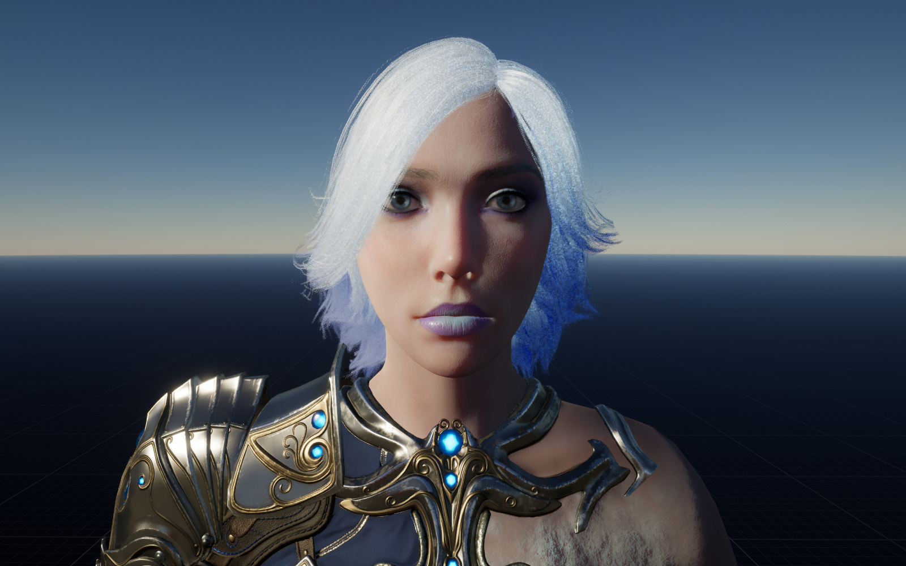
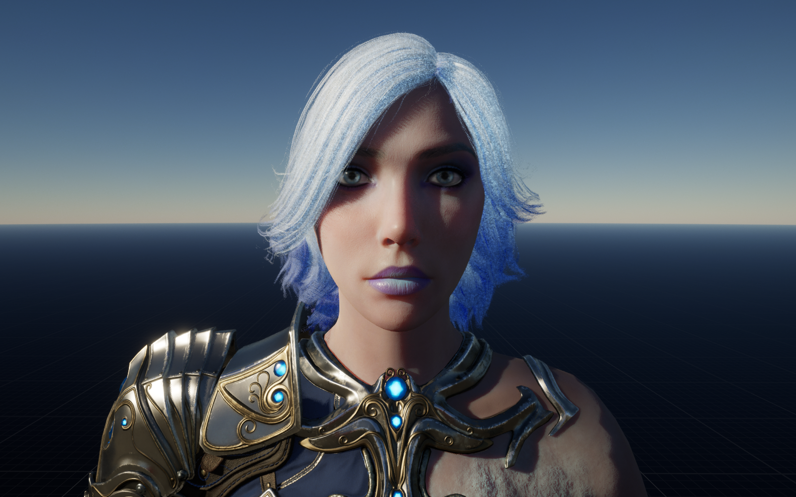
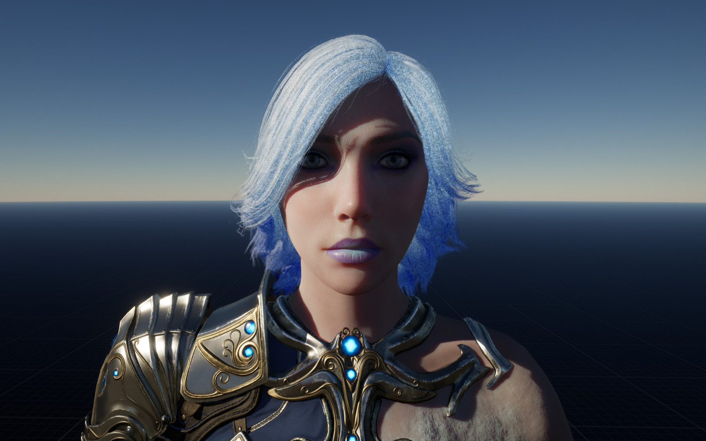
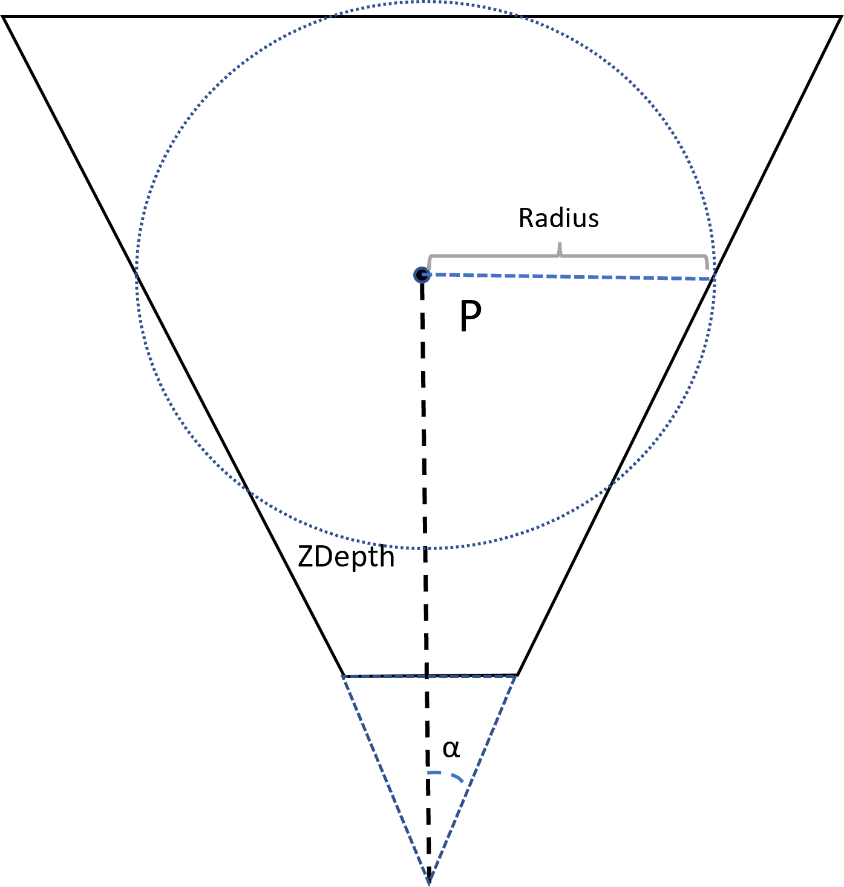
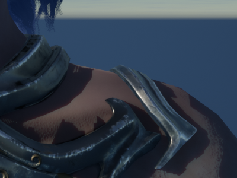
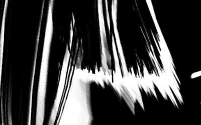
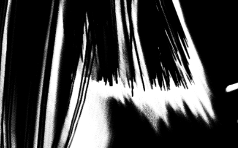

# Contact Shadow

## 概况
Contact Shadow也就是接触阴影，主要是为了弥补在ShadowMap精度不够的情况下增加细节阴影，通常用在人物模型渲染上，提高光影质量。在手游的捏脸界面，使用ShadowMap不能提供细腻的阴影效果，所以这里需要为手游前向管线开发ContactShadow。首先看UE5里ContactShadow的效果对比：

（下面的模型是Epic官方资产Aurora）

* Contact Shadow Off
 

* Contact Shadow On
 

 可以看到开了Contact Shadow，人物面部和衣服上的阴影细节提升了很多，整体效果提升很多。

 不过在UE5里面支持了VSM(Virtual Shadow Map)，开了VSM后在不开启ContactShadow的情况下也能提供很细腻的细节阴影，如下

 * VSM On, Contact Shadow Off
  

  开启VSM后，阴影质量明显又进一步提升，不过这也意味这VSM的消耗会更高，在移动平台上显然不合适，所以本文还是围绕Contact Shadow，暂不考虑VSM

  ## 技术原理
  Contact Shadow的技术原理还是很简单的，其实就是在屏幕空间上对这光源方向RayMarch，实际上只需要屏幕空间深度即可。不过如果直接对每个像素进行RayMarch那么必定会出现明显的分块锯齿的Artifact，那么这里可能就需要加入Dither，有了Dither又会引入噪点，所以这里可能会使用Temporal的降噪，这些会在下面介绍。

  ## UE5实现方案
  首先可以参考一下UE5的实现方案，应该和UE4差不多，UE的实现Shader很清晰，就一个eferredLightingCommon.ush文件下的ShadowRayCast函数，主要就是分析一下这个函数的细节，这样就可以应用到自己的项目中。
  
  核心代码：
  ```cpp
  // Returns distance along ray that the first hit occurred, or negative on miss
// Sets bOutHitCastDynamicShadow if the hit point is marked as a dynamic shadow caster
float ShadowRayCast(
	float3 RayOriginTranslatedWorld, float3 RayDirection, float RayLength,
	int NumSteps, float StepOffset, out bool bOutHitCastContactShadow )
{
    // RayOriginTranslatedWorld：View Space的像素位置，Trace的起始位置 
    // RayDirection：光线方向
    // RayLength：Trace的距离，这里是世界空间里的距离，下面会提到
    // NumSteps：步进数量
    // StepOffset：步进偏移，用于抖动

    // RayStartClip：Clip空间的Ray Start位置，Clip空间
    // RayEndClip：
	float4 RayStartClip	= mul( float4( RayOriginTranslatedWorld, 1 ), View.TranslatedWorldToClip );
	float4 RayDirClip	= mul( float4( RayDirection * RayLength, 0 ), View.TranslatedWorldToClip );
	float4 RayEndClip	= RayStartClip + RayDirClip;

    // 
	float3 RayStartScreen = RayStartClip.xyz / RayStartClip.w;
	float3 RayEndScreen = RayEndClip.xyz / RayEndClip.w;
	
	float3 RayStepScreen = RayEndScreen - RayStartScreen;

	float3 RayStartUVz = float3( RayStartScreen.xy * View.ScreenPositionScaleBias.xy + View.ScreenPositionScaleBias.wz, RayStartScreen.z );
	float3 RayStepUVz = float3( RayStepScreen.xy * View.ScreenPositionScaleBias.xy, RayStepScreen.z );

	float4 RayDepthClip	= RayStartClip + mul( float4( 0, 0, RayLength, 0 ), View.ViewToClip );
	float3 RayDepthScreen = RayDepthClip.xyz / RayDepthClip.w;

	const float Step = 1.0 / NumSteps;

	// *2 to get less moire pattern in extreme cases, larger values make object appear not grounded in reflections
	const float CompareTolerance = abs( RayDepthScreen.z - RayStartScreen.z ) * Step * 2;

	float SampleTime = StepOffset * Step + Step;

	float FirstHitTime = -1.0;

	const float StartDepth = SceneTexturesStruct.SceneDepthTexture.SampleLevel( SceneTexturesStruct_SceneDepthTextureSampler, RayStartUVz.xy, 0 ).r;

	UNROLL
	for( int i = 0; i < NumSteps; i++ )
	{
		float3 SampleUVz = RayStartUVz + RayStepUVz * SampleTime;
		float SampleDepth = SceneTexturesStruct.SceneDepthTexture.SampleLevel( SceneTexturesStruct_SceneDepthTextureSampler, SampleUVz.xy, 0 ).r;

		float DepthDiff = SampleUVz.z - SampleDepth;
		bool Hit = abs( DepthDiff + CompareTolerance ) < CompareTolerance;
		// Avoid self-intersection with the start pixel (exact comparison due to point sampling depth buffer)
		Hit = Hit && ( SampleDepth != StartDepth );

		FirstHitTime = (Hit && FirstHitTime < 0.0) ? SampleTime : FirstHitTime;

		SampleTime += Step;
	}

	float HitDistance = -1.0;
	bOutHitCastContactShadow = false;
	if ( FirstHitTime > 0.0 )
	{
		// Ignore hits that come from non-shadow-casting pixels
		float3 SampleUVz = RayStartUVz + RayStepUVz * FirstHitTime;
		FGBufferData SampleGBuffer = GetGBufferData( SampleUVz.xy );
		bOutHitCastContactShadow = CastContactShadow(SampleGBuffer);

		// Off screen masking
		float3 HitUVz = RayStartUVz + RayStepUVz * FirstHitTime;
		bool bValidUV = all( 0.0 < HitUVz.xy && HitUVz.xy < 1.0 );
		HitDistance = bValidUV ? ( FirstHitTime * RayLength ) : -1.0;
	}	
	
	
	return HitDistance;
}
  ```

  为了能够Trace步进距离随着距离的远近更好的适配（距离越远世界空间Trace的StepDistance越远，保证远处的ContactShadow尽量正确），所以这里的RayLength计算如下：
	

RayLength就以Radius值做为基数（一般scale小于0.1），可以看到随着距离越近，Radius越小，Trace的精度也随之变高，这样可以提供一个比较稳定的Trace步进。计算方法：
已知深度Z（线性深度），$\alpha=\frac{fov}{2}$
$$Radius=Z\times tan(\alpha) \times \frac{Width}{Height}$$

这里的Width和Height是视口长宽比，因为这是根据横轴来确定值。

其他部分就还是比较常规的raymarch。

## 移动平台效果优化
### Trace Offset
直接raymarch会产生很明显的artifact，明显的块状现象，这是由于步进距离是固定的，在步进次数不够的时候就会产生这种问题，所以正常会给个起始点的offset，这跟体积云的操作是一样的，如下：
* Dither Off

* Dither On


可以看到阴影边缘过渡明显更加平滑，效果更佳。


但是有了Dither后就会产生噪点，PC上使用TAA解决了这个问题，但是移动平台目前还没有，所以需要单独有个Temporal filter的操作，不过需要注意的是这并没有TAA那么复杂，实际上只要用到TAA里的两步即可：
* 历史帧信息混合，$P_t$是上一帧信息，$c_t$是当前帧信息， $P_t=(1-\alpha)\cdot P_{t-1}+\alpha \cdot c_t$ 
* clamp操作，处理ghosting

由于只对shadowmask图做filter，所以重投影和velocity buffer不太需要（其实也不好生成），但是最终的结果可以接受。

### Soft Shadow
还有一点是软阴影的处理，上面可以看到阴影整体还是比较硬，实际是需要美术可以通过设置来调整软阴影范围，这里就通过每帧在一定范围内随机方向发射光线，16帧为1个周期（这里可以减到8帧用来缓解lag，每帧trace两个方向，如果一个方向stepnum是8，那么两次trace可以接受），最后配合temporal filer降噪，结果如下：
* soft shadow off


* soft shadow on


白色为阴影区域，模糊半径的值由美术调整

随机序列使用Halton序列，这里预先计算好，runtime根据像素位置输出随机值旋转这个序列。同时这里需要注意，直接对结果做clamp的软阴影效果不太好，还是需要把clamp结果和当前帧混合结果做lerp，不过这样就需要在lag和noise之间做权衡了。