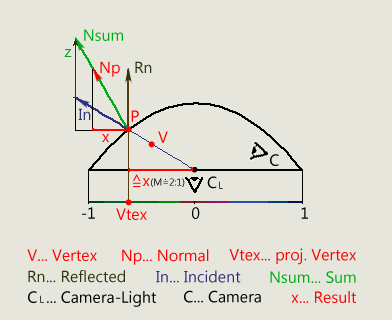

## DPSM
在渲染点光源阴影时，正常流程是渲染一个Cubemap深度，也就是6个面的深度图，这也意味着要切6次RT，这在移动平台上消耗太高，所以就有了Dual paraboloid shadow mapping(DPSM)，其原理就是把一个球面映射到两张深度图上，相对于原本的6张压力要小很多。

### 映射原理
其原理很简单，就是选一个抛物线作为球面，一一映射到平面，这里选取抛物线：
$$f(x,y)=\frac{1}{2}-\frac{1}{2}(x^2+y^2)$$

如下图：

* 推导过程
1. 定义 $P=(x,y,f(x,y))$
2. 对$x,y$两分量求偏导
    * $T_x=\frac{dP}{dx}=(1,0,\frac{df(x,y)}{dx})=(1,0,-x)$
    * $T_y=\frac{dP}{dy}=(0,1,\frac{df(x,y)}{dy})=(0,1,-y)$
3. 求得表面法线：$N_p=T_x \times T_y=(x,y,1)$

上面是推导根据坐标(x,y)求对应的发线方向，在绘制深度时需要根据射线方向**In**求得法线$N_p$，从而得到对应UV坐标$(x,y)$，首先推导原点$C_l$到点$P$的模：

1. $P=(x,y,f(x,y))$
2. 模平方：$x^2+y^2+z^2$

    $=x^2+y^2+\frac{1}{4}-\frac{1}{2}(x^2+y^2)+\frac{1}{4}(x^2+y^2)^2$
    $=\frac{2(x^2+y^2)+1+(x^2+y^2)^2}{4}$
    $=\frac{(x^2+y^2+1)^2}{4}$

3. 设模长为$\alpha$，则$\alpha=\frac{x^2+y^2+1}{2}$

下面反推$(x,y)$：
1. In为单位向量，根据上面的推导可得：$In=(\frac{1}{\alpha}x,\frac{1}{\alpha}y,\frac{1}{\alpha}z)$
2. 根据上图可得：$\frac{N_{sum}}{N_{P}}=\frac{1}{\alpha}$
3. 所以得：$N_{sum}=N_{P}\times \frac{1}{\alpha}$
    $=(x,y,1)\times \frac{1}{\alpha}$
4. 设未知变量$\beta$，$\frac{1}{\alpha}z+\beta=\frac{1}{\alpha}$，求$\beta$
5. $\beta=\frac{1}{\alpha}(\frac{1}{2}+\frac{1}{2}(x^2+y^2))$
    $\beta=\frac{1}{\alpha}\frac{1+(x^2+y^2)}{2}$
    $\beta=1$

所以可得要求得法线方向$N_{sum}=In+(0,0,1)$

$ln$在计算顶点位置时就可以得出，那么得到$N_{sum}$后标准化求出$N_{P}$，UV坐标就显而易见了。