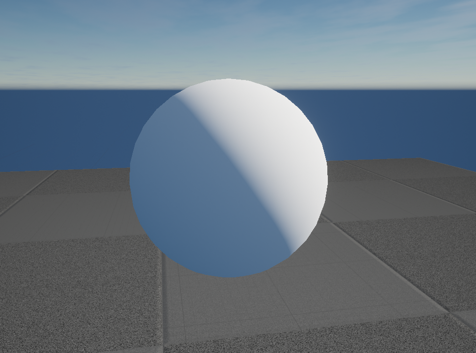
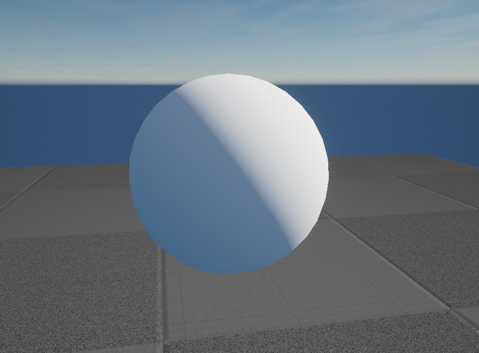
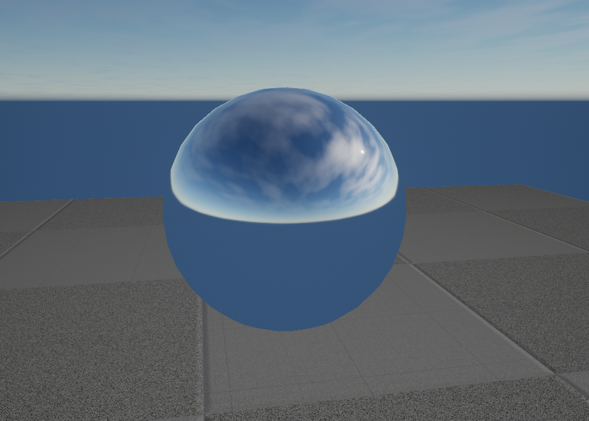
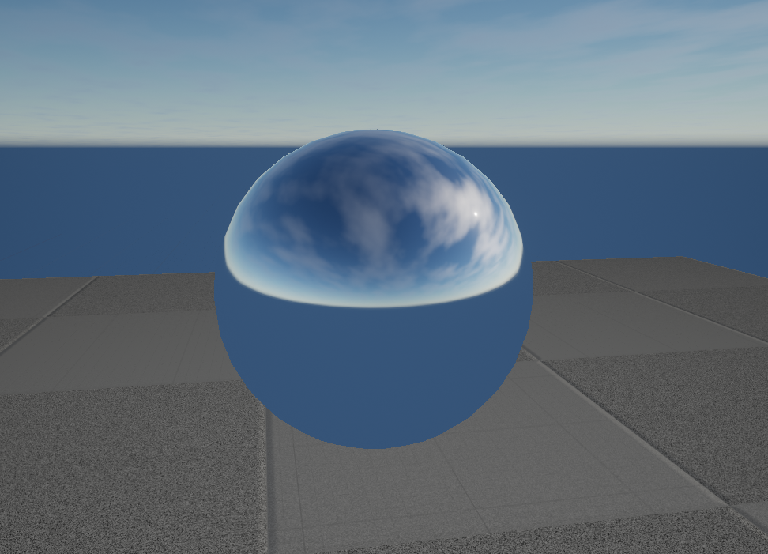

## 简介
为了适应开放世界种TOD的需求，天光的实时变化是个刚需，正常来说有两种做法：第一种预计算不同时间段的IBL，Runtime插值，不够灵活。第二种还是Runtime Filter，更加灵活，但是会消耗一定性能。
这里我们选择runtime计算，Skylight的Capture性能消耗还好，但是最终需要的是预积分后的结果（Diffuse，Specular），这个预积分正常情况下可以放在离线处理，UE4移动平台是在游戏启动时做一次Filter，Runtime想要更新Filter就需要调用**UpdateAllSkyCaptures()**，不过这个实现在处理Diffuse部分的时候很冗余，给9个球谐系数分别计算6个面的球谐值然后再累加，计算量非常巨大，如果runtime调用必定会产生GPU的Block，所以这里需要做一下优化。

## 优化思路
### Diffuse
漫反射部分其实正常来说应该非常简单，UE那么做可能是为了兼容API比较旧的机器，正常来说就可以像烘焙Irradiance Volume那样（一般Irradiance Volume也是用球谐表示Diffuse间接光），直接对Environment Cubemap球面进行一定数量的随机采样（比如64/128），生成Radiance的三阶球谐，Runtime的时候转成需要的Irradiance。

### Specular
高光部分依旧是很常规的操作，对Cubemap的6个面进行Environment map的积分，根据粗糙度Filter对应的Mip，BRDF LUT还是用原来的。这里在粗糙度为0的时候可以直接用原生未积分EnvironmentMap，因为完美镜面反射高光反射波瓣很小，可以近似为原图。同时还可以做分帧的优化，比如每帧对一个面积分处理，分6帧完成。

### 安卓OpenGL ES问题
这里要兼容opengl es会有一个问题，UE4默认不支持imageCube关键字，这就导致无法把Cubemap当作UAV写数据，总的来说就是UE4不支持opengles在CS中对Cubemap写入数据。导致这个原因一方面是UE在RHI层面没有支持imageCube的参数传入，另一方面是hlslcc没有翻译imageCube关键字。

UE不翻译imageCube的原因主要是DirectX，DX里没有RWTexureCube关键字，Cubemap UAV是被当成RWTexture2DArray，在**Platform.ush**中有如下定义：
```cpp
#ifndef RWTextureCube
#define RWTextureCube RWTexture2DArray
#endif
```
这也就导致了hlslcc在翻译的时候，直接把imageCube翻译成了image2DArray，这样glsl就无法往cubemap写入数据，所以这里就得支持HLSLCC对RWTextureCube到imageCube的翻译。

* 首先需要在glsles情况下不进行RWTextureCube的转换：
    ```cpp
    #ifndef RWTextureCube
        #if !COMPILER_GLSL_ES3_1
            #define RWTextureCube RWTexture2DArray
        #endif
    #endif
    ```
* UE的HLSLCC使用mesa作为中间语言，其实修改起来很方便，只需要加个关键字映射再自动生成代码即可，hlslcc库在hlsl_lexer.ll、hlsl_parser.ll添加关键字，使用工具生成代码，CPP文件glsl_types添加"RWTextureCube"到"imageCube"的映射。
* RHI层API的支持：
    * 对Cubemap指定Mip的读写操作不支持，这里需要拓展一下
    * 需要把bLayered设置为true，UE默认只对GL_Texture_3D开启，这里需要对GL_TEXTURE_CUBE_MAP开启

### 实现
有了Opengles API层面的支持，我们就可以写上层具体逻辑，大致流程就是前面提到的优化思路，不过这里可能要涉及到Diffuse部分球谐数据回读的问题，这里计算完不会立即执行阻塞式回读，在执行Diffuse Convolution的时候插入fence，确保CS执行完毕再回读数据。

### 结果对比

* Fast IBL Filter Diffuse

* Default IBL Filter Diffuse


* Fast IBL Filter Specular

* Default IBL Filter Specular


可以看出和默认的相比，结果相差几乎可以忽略不记，而且在天光实时更新的情况下，性能影响是无感的。除了可以用于天光，实际上可以用于Reflection Capture的实时Filter，只需要提前存好Capture的Mini Gbuffer(Albedo,Normal)，runtime进行relight，然后再执行fast ibl filter。

### Tips
UE的天光高光Filter在移动平台存在一个bug（4.26），在高光filter的时候由于精度问题导致数值溢出造成结果误，这里对其一点修改即可，在**ReflectionEnvironmentShaders.usf**文件中：
```cpp
line 355: const float SolidAngleTexel = 4*PI / ( 6 * CubeSize * CubeSize ) * 2;
--> const float SolidAngleTexel = 4.0f * PI / float(6 * CubeSize * CubeSize) * 2.0f;
```
不过这个bug在4.27已经被修复。

