## 大气概述
大气主要是计算太阳光穿过大气经过衰减一次次的散射到达人眼的结果，如下图：

* 从A点观察B点的天空颜色，首先考虑P点，阳光从C点进入大气层到达P点，这个过程本身就具有衰减也就是Transmisttance，然后再P点发生散射，然后再到达A点这个过程也具有衰减，也就是视线上的一个点会经过两次衰减到达观察点。

根据上面可以得知，大气计算核心内容就是Transmittance和Scattering，散射分为Rayleigh散射和Mie散射，前者是针对空气中小粒子对光的散射，如空气中的氧气、氮气分子，后者则是针对空气中大粒子对光的散射，如尘埃，雾气。天空中呈现的颜色主要是受Rayleigh散射和光波长的影响，散射公式：，可以看出和波长成反比，所以白天阳光穿过的大气距离短，蓝光波长短散射程度越大，所以天空呈蓝色，傍晚阳光穿过大气的距离长，蓝光受散射影响大到达不了人眼，红光波长长受散射影响少所以能穿过大气到达人眼，所以傍晚呈红色，Mie散射主要是对大粒子的散射，表现为绕太阳一圈的光晕，这也就是大气散射的基本原理。

目前涉及到的都是单级散射，如果是多级散射会复杂很多，还需要考虑地面辐照度的影响，这是个递归的过程，还需要做球面积分处理。

## 大气优化方案
UE4目前内置的大气系统是纯实时计算，每帧会运行5个ComputeShader，如下：
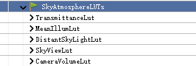

* TransmittanceLut，透射率Lut
* MeanIllumlut，用于计算多级散射的Lut，包含了很多的trick
* DistantSkyLightLut，计算地面辐射率的Lut
* SkyViewLut，天空辐射率Lut，需要对其中每个像素进行RayMarch，在后面渲染天空的时候会对这张Lut进行采样
* CameraVolumeLut，相机透射Lut，用于表现在大气影响下的雾气效果，如在远处有雾蒙蒙的效果

UE4目前就要跑上面的CS，5个ComputeShader还是算挺多的了，在我们游戏中主光源是静态的，所以大气完全可以预计算出来，类似天刀手游，天刀手游大气也是纯预计算，运行期只需要进行查找。所以Lut计算上有下面几个优化点：
* 透射率完全可以预计算
* 多级散射可以完全通过预计算得出，但是这里这能表示固定级数，UE4目前的通过trick得到多级散射，并且完全预计算需要用到3DTexture
* SkyViewLut直接对预计算散射Lut进行查询采样，不需要进行RayMarch
* 最后一个相机透视图，也可以直接对Transmittance和散射Lut进行采样，不需要RayMarch，并且UE4内置是32x32x4，实际上我们只需要计算一层就可以了，第一层表示的距离就已经是5km，已经超出地图大小，所以只需要一层

采用预计算后的结果如下：
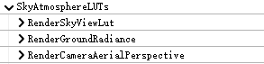

* RenderSkyViewLut：计算SkyViewLut
* RenderGroundRadiance：计算地面辐射率，与原版不太一样，但是这个值不是很重要，正常情况下用不到
* RenderCameraAerialPerspective：计算相机透视，只计算了一层，并且是通过查询得到结果

这里的预计算散射Lut是在编辑器下计算然后保存为Uasset，资源如下图：

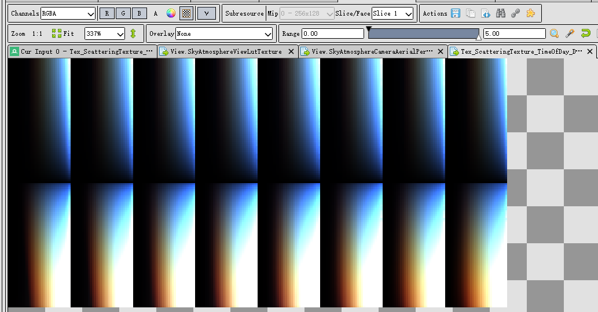

如果是要支持动态光源，那么就需要128x256x8大小的RGBA16f贴图），但是如果只是支持静态光源，那么就只需要128x32x8（图2.3.2），会小很多，内存节省也比较重要，但是效果是完全一样的，如下图：
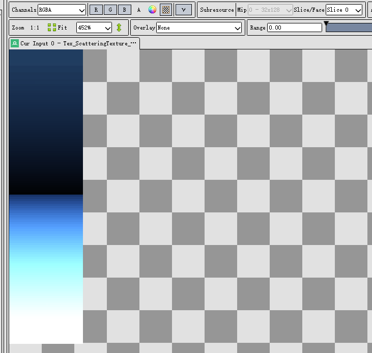

下面三张图分别是：全尺寸散射Lut计算结果、固定光源方向散射Lut计算结果、UE4实时计算结果。在白天的时候天空辐射率结果基本一致：
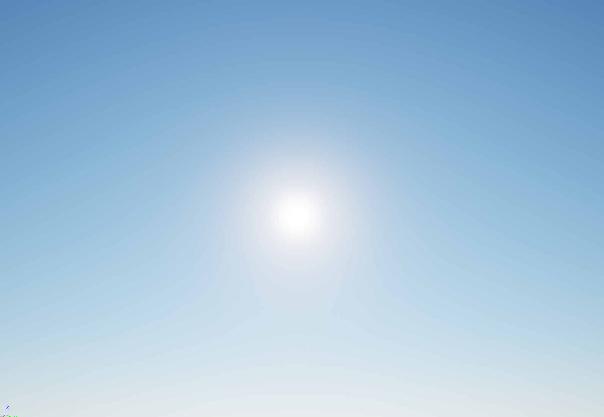

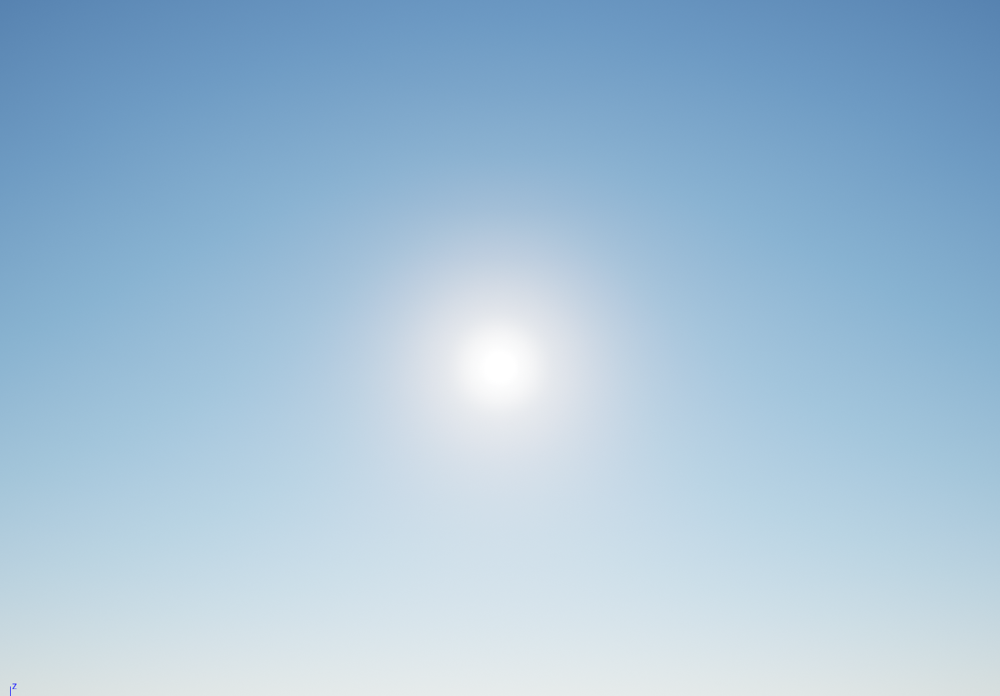

但是在夕阳的时候，结果会有明显的差异，分别为UE4实时大气，预计算1级散射，预计算5级散射，预计算10级散射 如下对比：

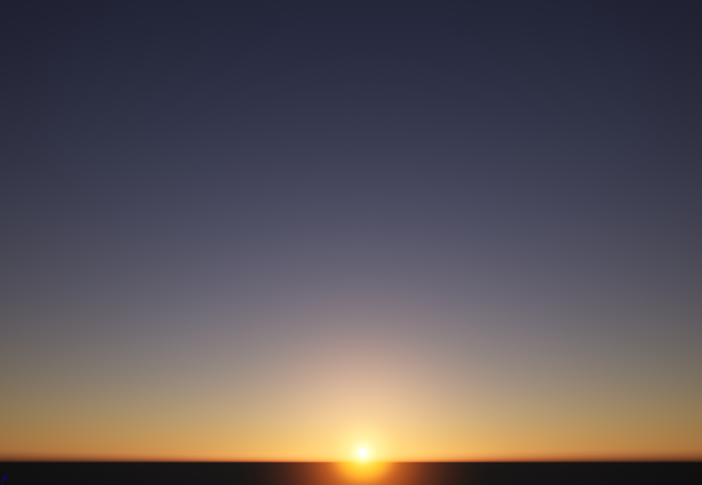
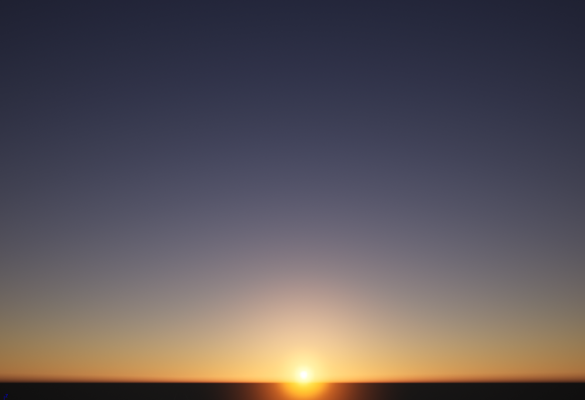

上面的图可以看出，在夕阳下，UE4实时大气的效果和预计算1级散射相似（也成为零级散射），但是与其他多级散射差别比较大，猜测是使用了比较多的trick，比如在实时大气中忽略了地面辐照度对散射的影响，所以与预计算多级散射有比较大的区别。

还有一张比较重要的就是AerialPerspective图，在预计算散射情况下与实时计算的结果类似，如下图：
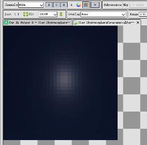
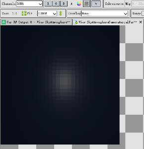

### Shading部分的优化
在SkyViewLut计算完之后，需要运用到天空盒的渲染，但是这个映射并非线性的，因为在地平线附近信息比较高频，所以就需要特定的映射关系，如下：
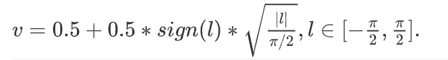
$l$ 就是纬度，可以看到维度越高，曲线越平缓，采样值范围也就越来越小，UE4在Mobile上的分辨率是96x50，我们可以适当增加Lut的高度，并适当减少Lut宽度，这样就可以省去这个映射关系，并且也不会在地平线附近有分层的Artifact，如下是Lut生成的对比图：
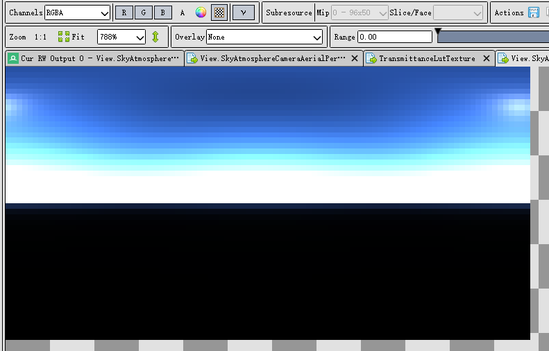
映射优化：
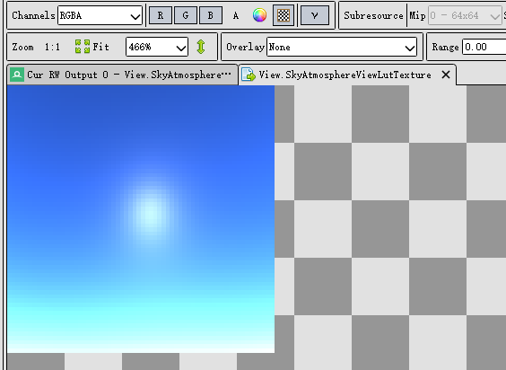

## 性能优化结果
游戏中天空渲染不应该占用太多性能，尤其是前面的几个ComputeShader，能省就省，后面会有很多地方需要用到CS，如ClusterLigthing，VTFeedBack，GPUDirven等，单单一个大气跑5个CS不合适，下面是优化结果：
* 高通450
优化后：
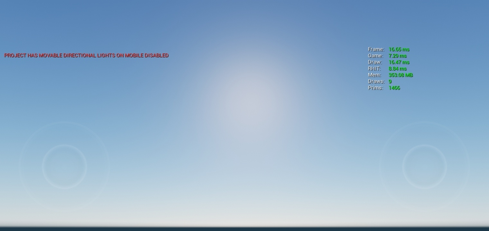
优化前：
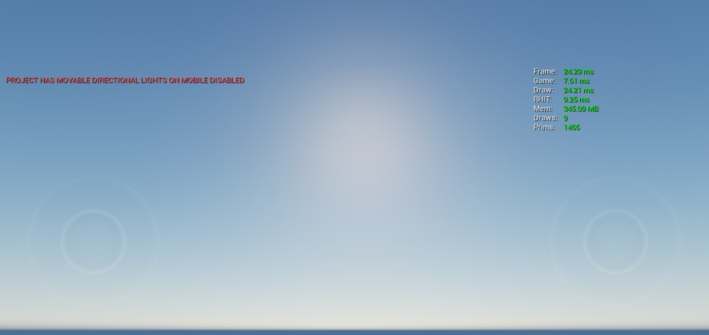
可以看到在低端机上可以省下很大一部分的Shading开销和CS开销，纯实时的是达不到满帧。

* 高通835
优化后：
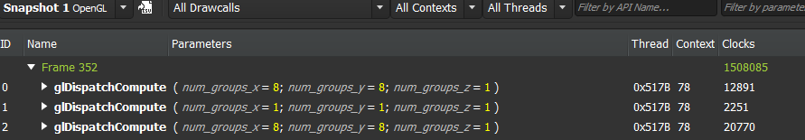
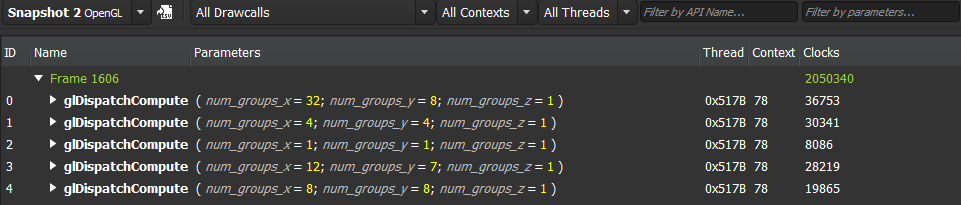

在高端机上优化的幅度不是很大，但是还是能减少不少的时钟周期可以看到从205万降到150万，这样可以有效减少GPU压力，减少发热对性能的影响。

总体来讲，大气的性能消耗可以压缩一部分，不占用太大的性能消耗。