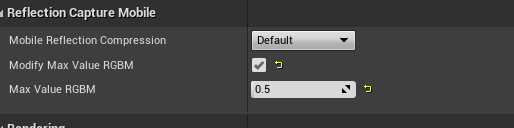
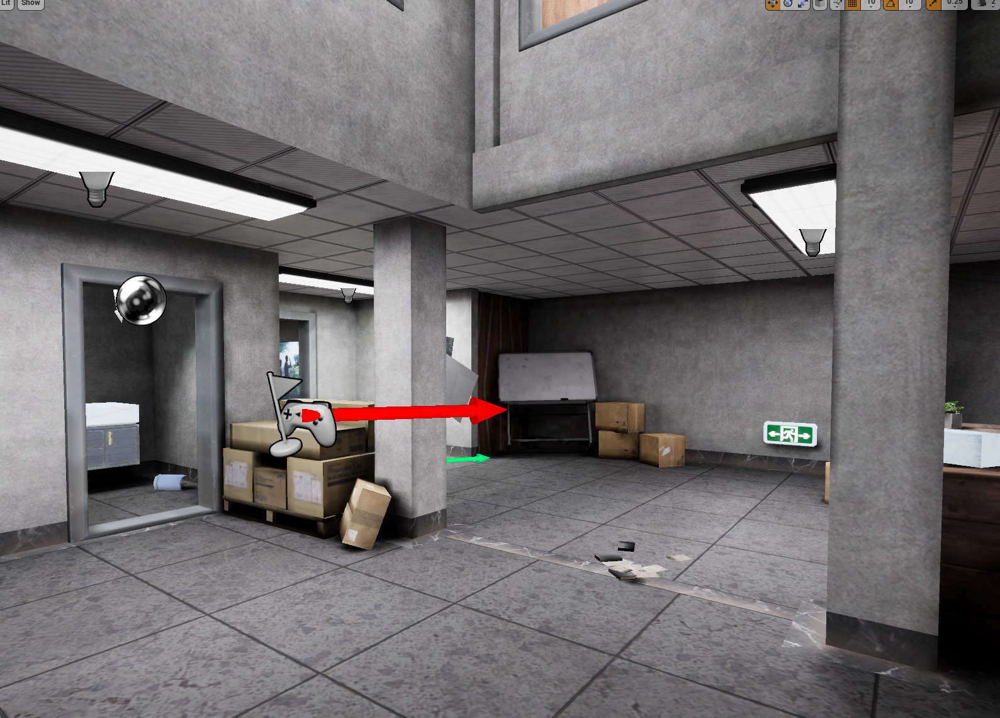
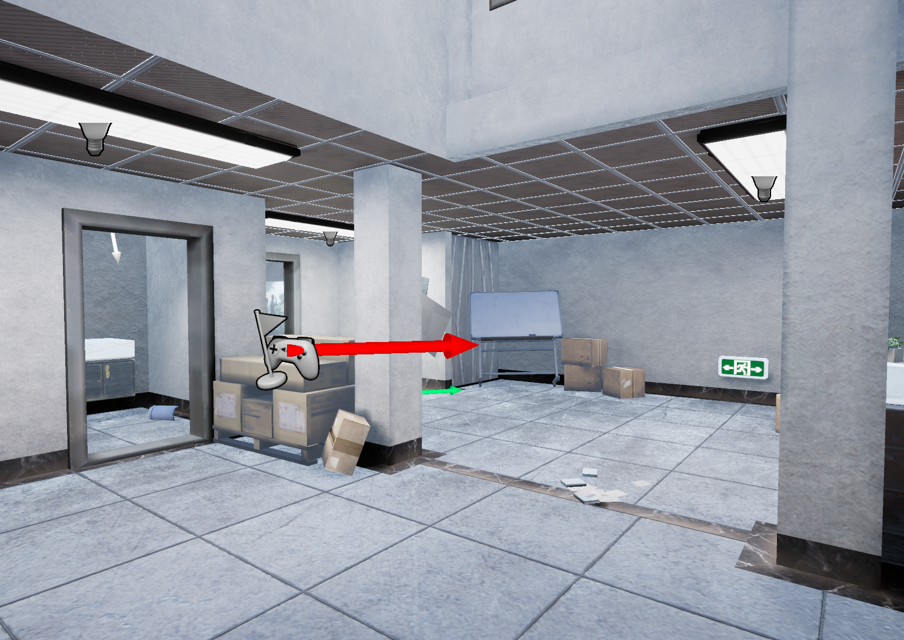
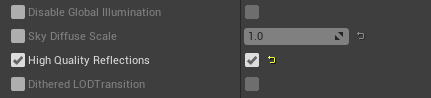
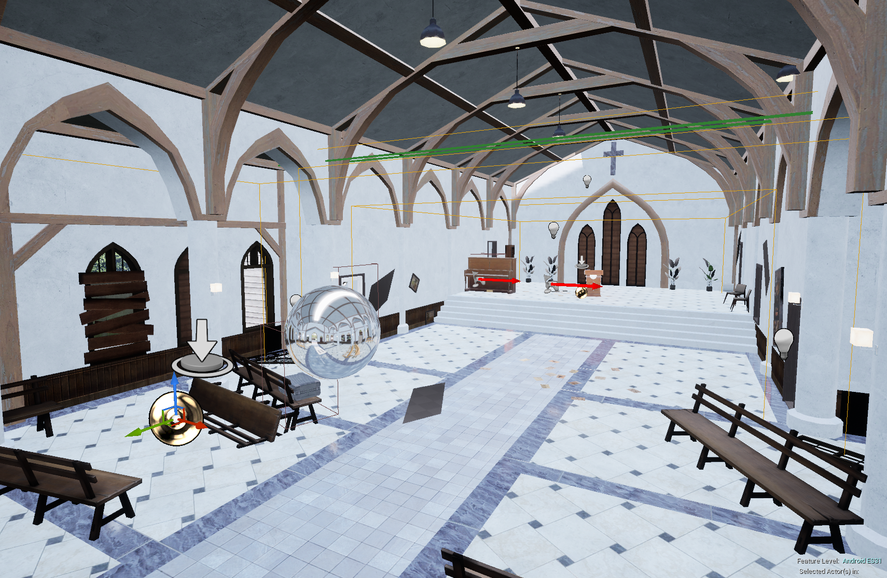

## Reflection Capture
UE4中内置了ReflectionCapture，可以实现比较正确的室内高光效果，以及部分室外高质量的反射效果，如水面的反射。UE4中的ReflectionCapture会存在两种效果，一种是普通质量，就是把天光的CubeMap替换进行采样，还有一种是High Quality，这种会同时采样多张来进行混合，并进行视差矫正，可以实现比较好的效果。但是移动平台会存在一些问题，我们对其做了一些修改。

## 存在的问题以及修改
* Capture的作用范围在移动平台失效，场景中一旦有Capture，动态物体就会一直受最近的Capture影响，天光对物体就不起作用，这个可以使范围生效，如果美术需要范围生效，可以提交这部分修改。
* 在High Quality反射的Shader中会一直采样3张cubemap，对这个进行一个优化，通过uniformbuffer传入影响当前mesh的Capture的数量，这样可以决定Shader里的采样次数，减少不必要的计算，原本希望通过Shader变体来决定Cubemap的数量，但是这样会导致Shader的数量翻倍，不合适。
* 由于我们的场景里的会有一个Mesh的大型建筑，但是一个Mesh顶多只能Cache3张CubeMap，静态的Mesh会一直使用这3张，不管相机的位置，一直就这3张，所以这里就根据玩家的视角，与Capture的距离以及Capture所占的屏幕比例来进行动态选择3张最合适的，但是在复杂场景下还是会出现问题。
* High Quality的选项只能的母材质中设置，这里就需要把这个选项移到材质实例中，因为项目中很多材质都是相同的母材质，改一下会影响全部，即使有Mesh是不需要这种高光反射的，比如水的材质实例中泳池材质可以使用高质量反射，但是海洋的不行。

## 使用规范
* 在大型建筑下，尽量使用一个ReflectionCapture，并且使用非High Quality，如果使用HighQuality，需要摆放多个Capture，并且结构复杂，会有效果错误。所以正常使用一个Capture就行，这样就已经可以保证室内效果正确。根据建筑形状可以放置BoxCapture或者SphereCapture，并且在构建完CubeMap后可以调整MaxValueRGBM来决定RGB亮度的范围，可以决定高光的细节程度，从而达到目标效果。同时也要注意尽量选择能够表示建筑室内大体特征的点进行Capture，这样的结果会更加自然。设置，Capture开关对比，可以看到关闭Capture的情况下会使用天光导致效果错误：

    开关ReflectionCapture对比：
    * 开启Reflection Capture
    
    * 关闭Reflection Capture
    

* 在有的情况下使用高质量反射的时候，需要在对应的材质实例上勾选High Quality Reflection，同时摆放在野外的两个Capture尽量不要相交，Capture的大小以要和需要反射的区域尽量保持一致的大小（这是为了保证视差矫正的时候效果正确）。

 如下三个效果的对比：
 * 关闭Capture
 
 * 开启Capture，Low Quality
 
 * 开启Capture，High Quality
 

 * 在一些需要表现高光的建筑里，可以适当摆放Capture，比如教堂那种结构比较简单的建筑可以放，但是像伊可豪宅这种特别复杂的不建议使用，即使一定要使用也要控制数量在3个及以下，但是要注意在室内摆放的时候两个Capture尽量要连接起来，否则会有接缝效果问题，如下这种摆放：
 