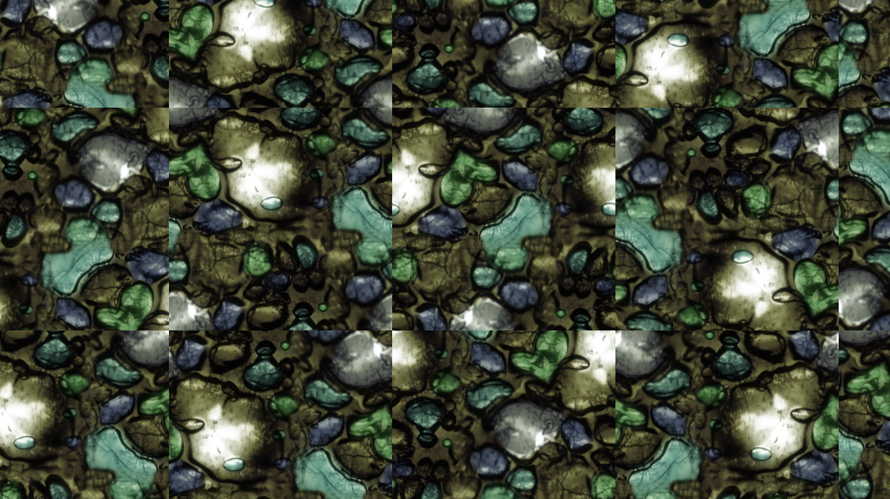
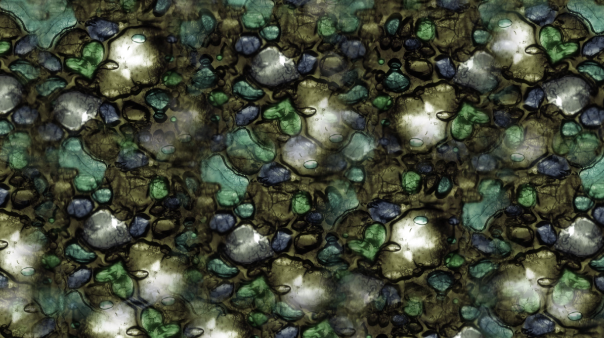
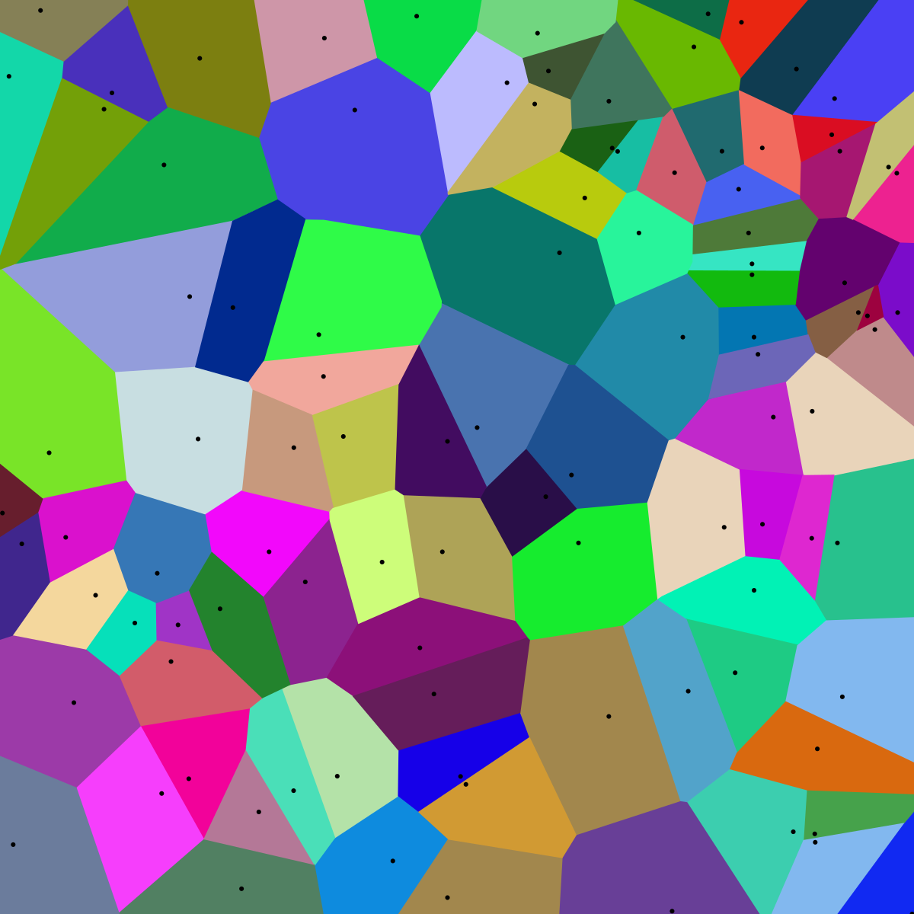

# Texture Anti Tiling
之前在做水面效果的时候，由于法线是tiling的形式，所以水面重复感很强，所以这里就总结一下贴图anti tiling的方法，本文参考自iq大佬，原文：[Anti tiling](https://iquilezles.org/articles/texturerepetition/)，文中有以下三种解决方案

## 方案 1
对每个tile做一个随机旋转、偏移，随机值一般从噪声图中获取，这里需要注意的是要处理Tile边界，因为经过旋转边界颜色值可能就不会正确过渡，所以这里需要处理，代码如下：
```cpp
vec4 textureNoTile( sampler2D samp, in vec2 uv )
{
    // 获取当前tile位置
    ivec2 iuv = ivec2( floor( uv ) );
    // 当前Tile内UV
    vec2 fuv = fract( uv );

    // 取随机值（可以是Noise Texture），作为当前tile的偏移旋转
    vec4 ofa = hash4( iuv + ivec2(0,0) );
    vec4 ofb = hash4( iuv + ivec2(1,0) );
    vec4 ofc = hash4( iuv + ivec2(0,1) );
    vec4 ofd = hash4( iuv + ivec2(1,1) );
    
    // 取UV的梯度，用于取mip
    vec2 ddx = dFdx( uv );
    vec2 ddy = dFdy( uv );

    // 计算当前tile的旋转，4个方向
    ofa.zw = sign( ofa.zw-0.5 );
    ofb.zw = sign( ofb.zw-0.5 );
    ofc.zw = sign( ofc.zw-0.5 );
    ofd.zw = sign( ofd.zw-0.5 );
    
    // 4个tile的UV旋转偏移，及梯度对应的旋转
    vec2 uva = uv*ofa.zw + ofa.xy, ddxa = ddx*ofa.zw, ddya = ddy*ofa.zw;
    vec2 uvb = uv*ofb.zw + ofb.xy, ddxb = ddx*ofb.zw, ddyb = ddy*ofb.zw;
    vec2 uvc = uv*ofc.zw + ofc.xy, ddxc = ddx*ofc.zw, ddyc = ddy*ofc.zw;
    vec2 uvd = uv*ofd.zw + ofd.xy, ddxd = ddx*ofd.zw, ddyd = ddy*ofd.zw;
        
    // 做插值，0.25，0.75为边界，为了处理边界seam的问题
    vec2 b = smoothstep( 0.25,0.75, fuv );
    
    return mix( mix( textureGrad( samp, uva, ddxa, ddya ), 
                     textureGrad( samp, uvb, ddxb, ddyb ), b.x ), 
                mix( textureGrad( samp, uvc, ddxc, ddyc ),
                     textureGrad( samp, uvd, ddxd, ddyd ), b.x), b.y );
}
```
* no lerp


* lerp



## 方案 2
本方案使用[smooth voronoi](https://iquilezles.org/articles/smoothvoronoi/)的方式来处理，voronoi图的特性是在切割后的区域内任意一点到当前块的特定点的距离比到其他特定点的距离要小，如下图：



但是这里使用Smooth Voronoi是为了Tile之间过渡自然，相当于每一块对应一个Tile，每个Tile对应着位置偏移，并且边缘会进行类似高斯模糊的方式过渡。

## 方案 3
最后一种方案是一个非常高效的方法，最少的采样数以及指令数，假设每个Tile都有多个虚拟分布版本，比如8，从这些版本中随机选取一个，每个版本都是以一定的编码方式进行偏移

```cpp
float sum( vec3 v ) { return v.x+v.y+v.z; }

vec4 textureNoTile( sampler2D samp, in vec2 uv )
{
    // 取一个随机值   
    float k = texture( iChannel1, 0.005*uv ).x;
    
    // 计算当前像素对应的的分布版本
    float index = k*8.0;
    float i = floor( index );
    float f = fract( index );

    // 对当前分布版本进行编码，生成偏移，这里生成两个是因为后面要做边界插值
    vec2 offa = sin(vec2(3.0,7.0)*(i+0.0)); // can replace with any other hash    
    vec2 offb = sin(vec2(3.0,7.0)*(i+1.0)); // can replace with any other hash    

    // 计算UV偏导
    vec2 dx = dFdx(uv), dy = dFdy(uv);
    
    // 分别采样两个版本的Color  
    vec3 cola = textureGrad( iChannel0, uv + offa, dx, dy ).xyz;
    vec3 colb = textureGrad( iChannel0, uv + offb, dx, dy ).xyz;

    // interpolate between the two virtual patterns    
    return mix( cola, colb, smoothstep(0.2,0.8,f-0.1*sum(cola-colb)) );

}
```