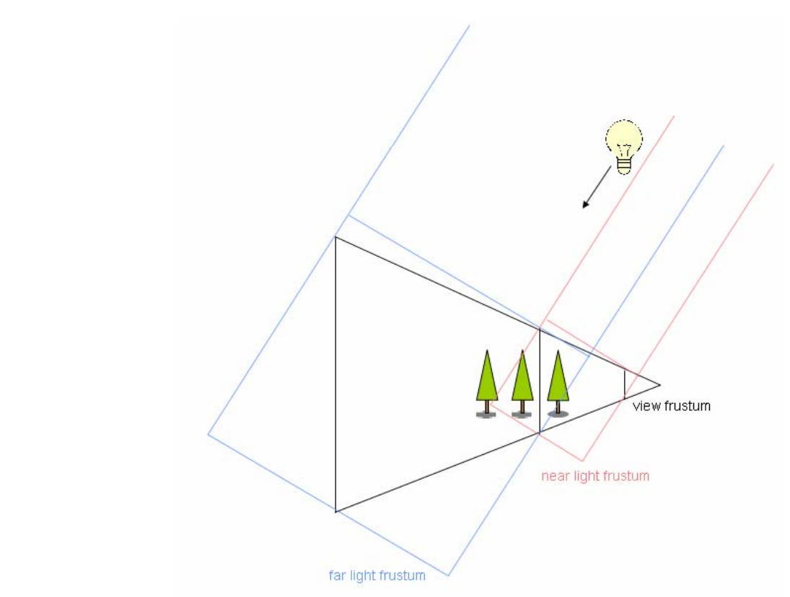
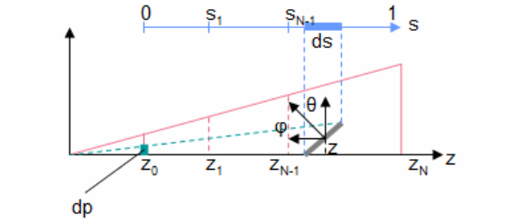
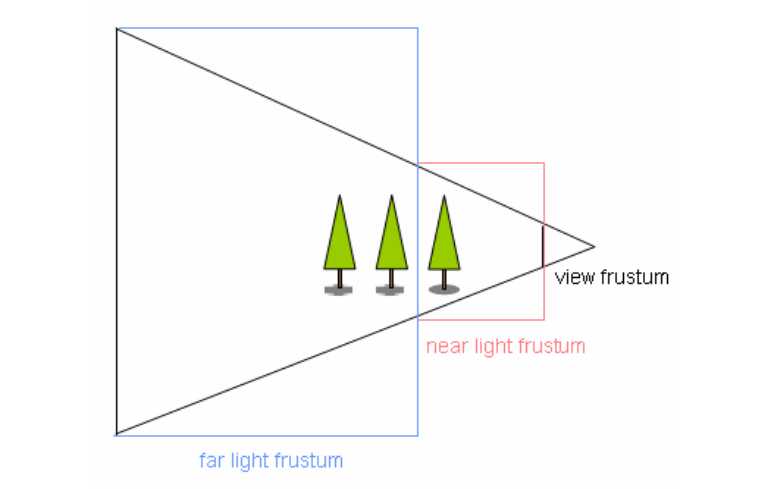
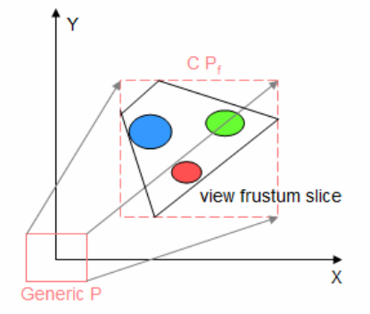
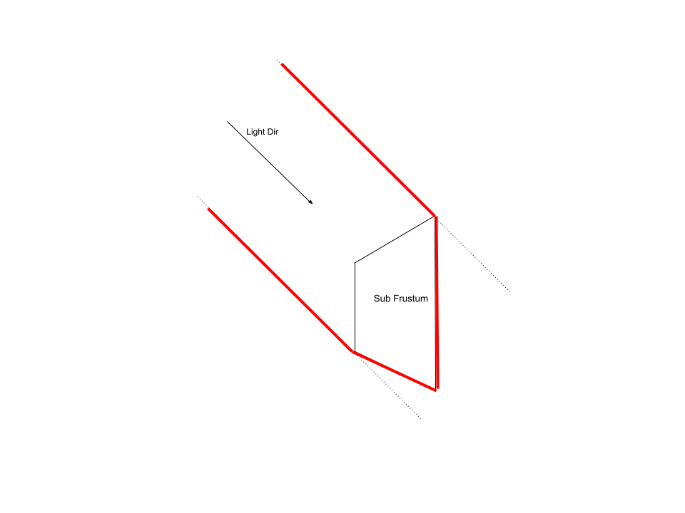
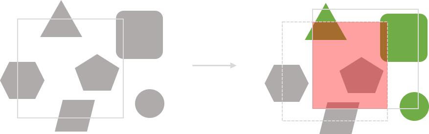
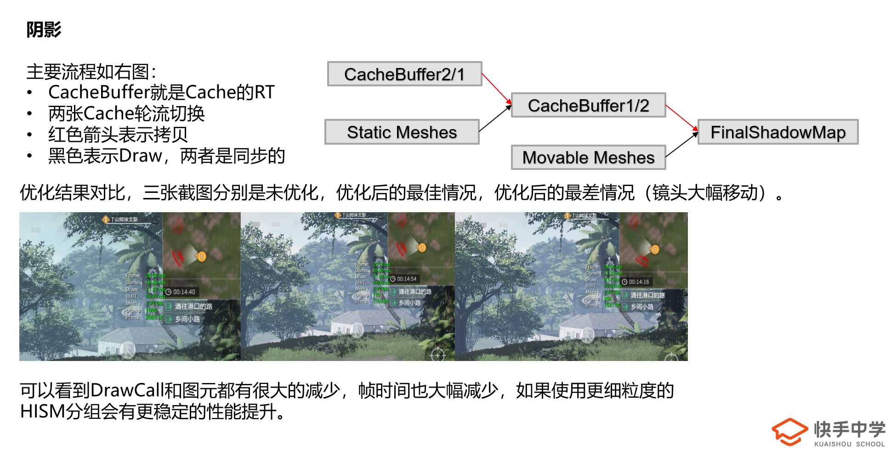
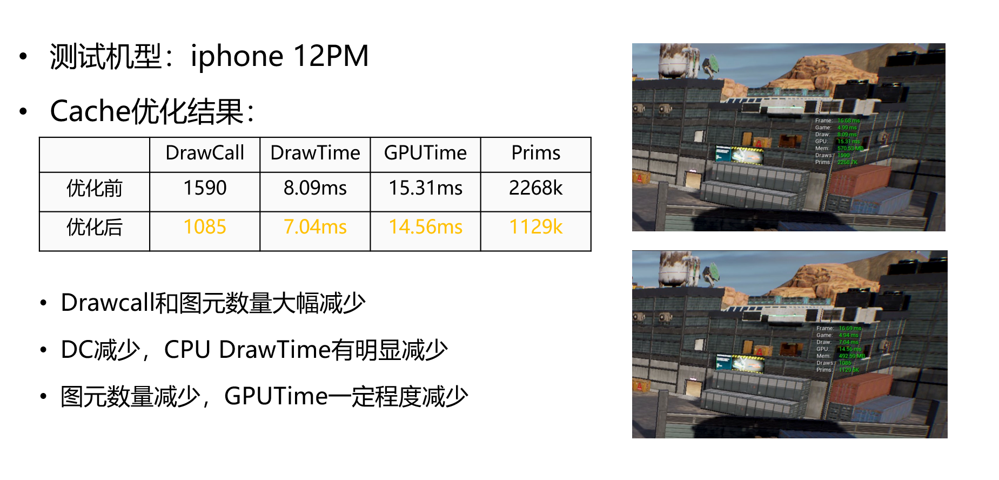

# Cascaded Shadow Map
级联阴影是用来绘制大场景阴影比较好的方案，大场景中要保证阴影的质量必须要有足够的分辨率，否则就会产生透视走样，但是单纯拉高Shadow Map的分辨率也不现实，因为这对性能和带宽来说都有很大的影响，用CSM可以进行分级，近处使用高分辨率的ShadowMap，远处就比较低（或者说同样的分辨率表现更大的范围），这样也充分的利用ShadowMap。算法流程基本如下：

* 对于每一个光锥体，从光源点绘制场景深度。
* 从视口相机位置渲染场景，基于像素点的深度选择对应级别的ShadowMap。

如下图：



## 相关方案

其实解决阴影走样问题还有其他的解决方案，如
Perspective Shadow Maps（PSM），CSM就是PSM的离散形式。PSM的思想就是用光源锥体把整个视锥体包住。就是在当前的相机空间中进行标准的阴影贴图的应用，但是这不能对光源的位置和类型做出改变，所以应用的地方比较少。

还有Light Space Perspective Shadow Maps（LiPSM），用一种方法包裹了相机锥体并且不会改变光源方向。

Trapzoidal Shadow Maps（TSM）构建一个摄像机视锥的梯形包围盒（与前面的LiPSM不一样）。

## 生成Shadow-Map

算法的第一步就是计算相机空间中设置分割的z值，比如一个shadow-map上的像素实际表示长度是$d_s$，那么投射到屏幕上的大小$d_p$就是基于被投影对象的位置和法线，如下公式：



$\frac{d_p}{d_s}=n\frac{d_z}{zd_s}\frac{cos{\varphi}}{cos{\theta}}$

这里$d_z$可以理解为1，$cos\varphi,cos\theta$就是光源方向相对于视锥体方向的夹角。

这里n就是视锥体近平面的距离，理论上为了保证在屏幕上相同的效果，在不同级别的下的ShadowMap保证相同的效果，$\frac{d_p}{d_s}$需要是一个常数，此外，我们也可以将余弦因素视为一个常数，所以，

$\frac{d_z}{zd_s}=\rho, \rho=ln(f/n)$

解上述的等式求$z$和离散化，分割数量需要呈指数分布，如下：

$z_i=n(\frac{f}{n})^{i/N}$


$N$就是分割的数量，但是如果按上面的方式分割，还会造成很多Shadow-Map面积浪费，有的区域在光锥体中但是不在视锥体中，但是当N趋于无穷时这个浪费的空间就趋于0，如下图：



所以需要对这一块进行改善，如下：

$z_i=\lambda n(f/n)^{1/N}+(1-\lambda)(n+(i/N)(f-n))$

$\lambda$控制着矫正的强度。

在得出分块的z值后，当前视锥块的角点是通过视口大小和屏幕的宽高比得出的。
如下图：



同时，将光源的ModelView矩阵$M$设为朝向光源方向，并且设置了通用正交投影矩阵$P=I$。然后将相机平截头体的每个角点投影到光源的Homogeneous空间的$P_h=PM_P$。每个方向上的最小$m_i$和最大$M_i$形成一个包围盒，该包围盒和光源视锥体对齐，从中我们可以确定缩放比例和偏移来使通用光源视锥与之重合。实际上这样可以确保我们在z轴上获得最佳精度，在x，y轴上尽可能的减少损失，这是通过构建矩阵$C$来实现的。最终光源投影矩阵$P$被改成$P=CP_z$，$P_z$矩阵是一个带有远近平面的矩阵。

# CSM In UE4

在UE4中有自带的Cascaded Shadow Map实现，下面主要是关于UE4中的CSM的渲染流程，主要针对的是移动管线。

## 流程

### Dynamic Shadow初始化
准备绘制CSM所需要的内容，主要内容在*FMobileSceneRenderer::InitDynamicShadows*中。

* FShadowProjectionMatrix：阴影投影矩阵

1. 收集受阴影影响的图元，这里就涉及到*FMobileCSMSubjectPrimitives*，该结构体用于存储受阴影投射的图元。
   调用堆栈：
   
    * *FSceneRenderer::InitDynamicShadows* 
        * *FSceneRenderer::AddViewDependentWholeSceneShadowsForView*：为指定光源整个场景的Shadow生成*FProjectedShadowInfos*。
          * *FDirectionalLightSceneProxy::GetShadowSplitBounds*：获取当前等级ShadowMap的Bound
          * *FProjectedShadowInfo::SetupWholeSceneProjection*：设置整个场景的投影信息
            * *FProjectedShadowInfo::UpdateShaderDepthBias*：更新当前的Bias
        * *FSceneRenderer::InitProjectedShadowVisibility*：初始化投影的阴影可见性，有的物体不在范围内就不会投射阴影，这里只是准备所需要的信息，一部分是前面计算好的
        * *FSceneRenderer::GatherShadowPrimitives*：进行视锥剔除，收集需要投射阴影的Primitive，这里使用八叉树收集然后多线程异步执行判断流程，这里面会收集PreShadow和ViewDependentWholeSceneShadow两种，前者就是烘焙阴影后者才是动态阴影
          * *FGatherShadowPrimitivesPacket::FilterPrimitiveForShadows*：多线程中的判断实际运行的函数
        * *FSceneRenderer::AllocateShadowDepthTargets*：为ShadowDepth分配RT
        * *FSceneRenderer::GatherShadowDynamicMeshElements* 

    计算每个级联块的Bounding函数，*GetShadowSplitBounds*：
    ```cpp
     // 获取该级CSM的近处和远处距离，这里就会用到参数里的CascadeDistributionExponent，该值越大，每一级的ShadowMap范围就越大
     float SplitNear = GetSplitDistance(View, ShadowSplitIndex, bPrecomputedLightingIsValid, bIsRayTracedCascade);
     float SplitFar = GetSplitDistance(View, ShadowSplitIndex + 1, bPrecomputedLightingIsValid, bIsRayTracedCascade);

     float FadePlane = SplitFar;

     float LocalCascadeTransitionFraction = CascadeTransitionFraction * GetShadowTransitionScale();

     float FadeExtension = (SplitFar - SplitNear) * LocalCascadeTransitionFraction;
     //...
     // 计算实际的Bounds
     const FSphere CascadeSphere = FDirectionalLightSceneProxy::GetShadowSplitBoundsDepthRange(View, View.ViewMatrices.GetViewOrigin(), SplitNear, SplitFar, OutCascadeSettings);
    ```

    *FDirectionalLightSceneProxy::GetShadowSplitBoundsDepthRange*里面涉及到一个公式用于计算视锥体的包围球中心偏移，推导如下：

    * 要计算视锥体包围球得中心，其实只要考虑三个变量
      * 远平面对角线的一半，$a$，包围球的大小受对角线长度的影响，和远近平面的边长无关
      * 近平面对角线的一半，$b$
      * 远近平面之间得距离，$l$
    * 经过上面的简化，实际上还是平面梯形的问题，设一个变量$x$为中心到远平面的距离，又已知中心点到4个顶点的距离相同，可以得到如下计算：
      * $x^2+a^2=b^2+{(l-x)}^2$
      * $x^2+a^2=b^2+l^2-2lx+x^2$
      * $2lx=b^2-a^2+l^2$
      * $x=\frac{b^2-a^2}{2l}+\frac{l}{2}$

    *FDirectionalLightSceneProxy::ComputeShadowCullingVolume*，该方法就是计算用于阴影剔除的几何体，就是根据当前级联锥体的每个面和每个点以及光线方向求出对应的几何体，这个比较精确的几何体，正常不是一个Box形状，它会根据相机视锥进行生成，实际的剔除区域如下（红色框内的区域）：

    


这里涉及到一个比较重要的结构体*FWholeSceneProjectedShadowInitializer*：

* FWholeSceneProjectedShadowInitializer：全场景阴影所需的信息
  * FProjectedShadowInitializer：投影阴影的Transform信息
    * FVector PreShadowTranslation：在被一个阴影矩阵转换到世界空间前的Translation
    * FMatrix WorldToLight：光源矩阵信息，如果是平行光就是一个旋转矩阵，一般是*FInverseRotationMatrix*
    * FVector Scales；
    * FVector FaceDirection：向前的方向，一般是*FVector(1,0,0)*
    * FBoxSphereBounds SubjectBounds：局部空间的Bounds信息，就是当前级别的
    * float MinLightW；
    * float MaxDistanceToCastInLightW：平行光的最大投射距离
  * FShadowCascadeSettings CascadeSettings：级联阴影所需的信息
    * float SplitNear：该级视锥近平面距离
    * float SplitFar：该级视锥远平面距离
    * float SplitNearFadeRegion：近平面渐变区域距离
    * float SplitFarFadeRegion：远平面渐变区域距离
    * float FadePlaneOffset：从相机到渐变区域的距离
    * float FadePlaneLength：SplitFar - FadePlaneOffset
    * FConvexVolume ShadowBoundsAccurate：用于图元剔除的精确几何体，一般是不规则形状
    * FPlane NearFrustumPlane;
    * FPlane FarFrustumPlane;
    * bool bFarShadowCascade：如果设为true那么就只会渲染标记为*bCastFarShadows*的物件
    * int32 ShadowSplitIndex：当前级的Index
    * float CascadeBiasDistribution：级联阴影的Bias

*FProjectedShadowInfo::SetupWholeSceneProjection*函数就是用来计算绘制阴影深度所需要的矩阵和一些其他的空间信息：

```cpp
FVector	XAxis, YAxis;
Initializer.FaceDirection.FindBestAxisVectors(XAxis,YAxis);
// 获取光源的World下的矩阵，注意这里Scale的y，z分量是 1/SphereRadius，这是为了后面的投影矩阵，因为ShadowProjectionMatrix没有区域的长和宽，所以直接在这里乘
const FMatrix WorldToLightScaled = Initializer.WorldToLight * FScaleMatrix(Initializer.Scales);
// 朝向矩阵，该矩阵可以理解为View Matrix，这里的FBasisVectorMatrix相当于重新构建了一个坐标系，有了这个转换后面就不需要乘以坐标系转换矩阵
const FMatrix WorldToFace = WorldToLightScaled * FBasisVectorMatrix(-XAxis,YAxis,Initializer.FaceDirection.GetSafeNormal(),FVector::ZeroVector);

{
    const float DepthRangeClamp = 5000;
    MaxSubjectZ = FMath::Max(MaxSubjectZ, DepthRangeClamp);
    MinSubjectZ = FMath::Min(MinSubjectZ, -DepthRangeClamp);

    // 把Shadow的Transform转换到Shadowmap的空间中
    const FVector TransformedPosition = WorldToFace.TransformPosition(-PreShadowTranslation);

    // 在阴影贴图DownSamples时允许的最大比例系数
    const int32 MaxDownsampleFactor = 4;
    // 当前阴影位置会多出的距离，为了下面的对齐
    const float SnapX = FMath::Fmod(TransformedPosition.X, 2.0f * MaxDownsampleFactor / InResolutionX);
    const float SnapY = FMath::Fmod(TransformedPosition.Y, 2.0f * MaxDownsampleFactor / InResolutionY);
    // 减去刚才超出的距离，并且转回到原来的坐标系下，这就与指定大小的阴影采样块对齐了，这样做主要是为了防止镜头移动的时候产生边缘闪烁
    const FVector SnappedWorldPosition = WorldToFace.InverseFast().TransformPosition(TransformedPosition - FVector(SnapX, SnapY, 0.0f));
    PreShadowTranslation = -SnappedWorldPosition;
    
    // 计算用于绘制深度的ViewProjection matrix
    SubjectAndReceiverMatrix = WorldToFace * FShadowProjectionMatrix(MinSubjectZ, MaxSubjectZ, Initializer.WAxis);
    
    // View matrix
    ShadowViewMatrix = Initializer.WorldToLight * 
		FMatrix(
		FPlane(0,	0,	1,	0),
		FPlane(1,	0,	0,	0),
		FPlane(0,	1,	0,	0),
		FPlane(0,	0,	0,	1));
}
```


*FSceneRenderer::UpdatePreshadowCache*，改函数是用来准备需要的PreShadow（PreShadow就是在使用Per Object阴影时会用到），加入到Cache，这里就不进行描述。

*FSceneRenderer::GatherShadowPrimitives*，就是筛选出需要绘制深度的图元，这里会先简单的进行一次阴影视锥剔除，然后在使用多线程进行精确剔除：

```cpp
// 对所有级别的阴影视锥进行逐个剔除
for (int32 ShadowIndex = 0, Num = ViewDependentWholeSceneShadows.Num();ShadowIndex < Num;ShadowIndex++)
{
    const FProjectedShadowInfo* RESTRICT ProjectedShadowInfo = ViewDependentWholeSceneShadows[ShadowIndex];
    const FLightSceneInfo& RESTRICT LightSceneInfo = ProjectedShadowInfo->GetLightSceneInfo();
    const FLightSceneProxy& RESTRICT LightProxy = *LightSceneInfo.Proxy;

    const FVector LightDirection = LightProxy.GetDirection();
    const FVector PrimitiveToShadowCenter = ProjectedShadowInfo->ShadowBounds.Center - PrimitiveBounds.Origin;
    // Project the primitive's bounds origin onto the light vector
    const float ProjectedDistanceFromShadowOriginAlongLightDir = PrimitiveToShadowCenter | LightDirection;
    // Calculate the primitive's squared distance to the cylinder's axis
    const float PrimitiveDistanceFromCylinderAxisSq = (-LightDirection * ProjectedDistanceFromShadowOriginAlongLightDir + PrimitiveToShadowCenter).SizeSquared();
    const float CombinedRadiusSq = FMath::Square(ProjectedShadowInfo->ShadowBounds.W + PrimitiveBounds.SphereRadius);

    // Note: Culling based on the primitive's bounds BEFORE dereferencing PrimitiveSceneInfo / PrimitiveProxy

    // Check if this primitive is in the shadow's cylinder
    if (PrimitiveDistanceFromCylinderAxisSq < CombinedRadiusSq
        // If the primitive is further along the cone axis than the shadow bounds origin, 
        // Check if the primitive is inside the spherical cap of the cascade's bounds
        && !(ProjectedDistanceFromShadowOriginAlongLightDir < 0 && PrimitiveToShadowCenter.SizeSquared() > CombinedRadiusSq)
        // Test against the convex hull containing the extruded shadow bounds
        // 这里就是使用之前得到的精确几何体进行相交检测
        && ProjectedShadowInfo->CascadeSettings.ShadowBoundsAccurate.IntersectBox(PrimitiveBounds.Origin, PrimitiveBounds.BoxExtent))
    {
        // Distance culling for RSMs
        const float MinScreenRadiusForShadowCaster = ProjectedShadowInfo->bReflectiveShadowmap ? GMinScreenRadiusForShadowCasterRSM : GMinScreenRadiusForShadowCaster;

        bool bScreenSpaceSizeCulled = false;
        check(ProjectedShadowInfo->DependentView);

        {
            const float DistanceSquared = (PrimitiveBounds.Origin - ProjectedShadowInfo->DependentView->ShadowViewMatrices.GetViewOrigin()).SizeSquared();
            bScreenSpaceSizeCulled = FMath::Square(PrimitiveBounds.SphereRadius) < FMath::Square(MinScreenRadiusForShadowCaster) * DistanceSquared * ProjectedShadowInfo->DependentView->LODDistanceFactorSquared;
        }

        bool bCastsInsetShadows = PrimitiveProxy->CastsInsetShadow();
        // If light attachment root is valid, we're in a group and need to get the flag from the root.
        if (PrimitiveSceneInfo->LightingAttachmentRoot.IsValid())
        {
            FAttachmentGroupSceneInfo& AttachmentGroup = PrimitiveSceneInfo->Scene->AttachmentGroups.FindChecked(PrimitiveSceneInfo->LightingAttachmentRoot);
            bCastsInsetShadows = AttachmentGroup.ParentSceneInfo && AttachmentGroup.ParentSceneInfo->Proxy->CastsInsetShadow();
        }
		
        // 下面是一段属性检测
        if (!bScreenSpaceSizeCulled
            && ProjectedShadowInfo->GetLightSceneInfoCompact().AffectsPrimitive(PrimitiveBounds, PrimitiveProxy)
            // Include all primitives for movable lights, but only statically shadowed primitives from a light with static shadowing,
            // Since lights with static shadowing still create per-object shadows for primitives without static shadowing.
            && (!LightProxy.HasStaticLighting() || (!LightSceneInfo.IsPrecomputedLightingValid() || LightProxy.UseCSMForDynamicObjects()))
            // Only render primitives into a reflective shadowmap that are supposed to affect indirect lighting
            && !(ProjectedShadowInfo->bReflectiveShadowmap && !PrimitiveProxy->AffectsDynamicIndirectLighting())
            // Exclude primitives that will create their own per-object shadow, except when rendering RSMs
            && (!bCastsInsetShadows || ProjectedShadowInfo->bReflectiveShadowmap)
            // Exclude primitives that will create a per-object shadow from a stationary light
            && !ShouldCreateObjectShadowForStationaryLight(&LightSceneInfo, PrimitiveProxy, true)
            // Only render shadows from objects that use static lighting during a reflection capture, since the reflection capture doesn't update at runtime
            && (!bStaticSceneOnly || PrimitiveProxy->HasStaticLighting())
            // Render dynamic lit objects if CSMForDynamicObjects is enabled.
            && (!LightProxy.UseCSMForDynamicObjects() || !PrimitiveProxy->HasStaticLighting()))
        {
            ViewDependentWholeSceneShadowSubjectPrimitives[ShadowIndex].Add(PrimitiveSceneInfo);
        }
    }
}
```

添加Mesh Emelents：

```cpp
for (int32 ShadowIndex = 0; ShadowIndex < ViewDependentWholeSceneShadowSubjectPrimitives.Num(); ShadowIndex++)
{
    FProjectedShadowInfo* ProjectedShadowInfo = ViewDependentWholeSceneShadows[ShadowIndex];

    bool bRecordShadowSubjectsForMobile = false;

    if (FSceneInterface::GetShadingPath(FeatureLevel) == EShadingPath::Mobile)
    {
        // record shadow casters if CSM culling is enabled for the light's mobility type and the culling mode requires the list of casters.
        static auto* CVarMobileEnableStaticAndCSMShadowReceivers = IConsoleManager::Get().FindTConsoleVariableDataInt(TEXT("r.Mobile.EnableStaticAndCSMShadowReceivers"));
        static auto* CVarMobileEnableMovableLightCSMShaderCulling = IConsoleManager::Get().FindTConsoleVariableDataInt(TEXT("r.Mobile.EnableMovableLightCSMShaderCulling"));
        static auto* CVarMobileCSMShaderCullingMethod = IConsoleManager::Get().FindTConsoleVariableDataInt(TEXT("r.Mobile.Shadow.CSMShaderCullingMethod"));
        uint32 MobileCSMCullingMode = CVarMobileCSMShaderCullingMethod->GetValueOnRenderThread()  & 0xF;
        bRecordShadowSubjectsForMobile = 
            (MobileCSMCullingMode == 2 || MobileCSMCullingMode == 3)
            && ((CVarMobileEnableMovableLightCSMShaderCulling->GetValueOnRenderThread() && ProjectedShadowInfo->GetLightSceneInfo().Proxy->IsMovable() && ProjectedShadowInfo->GetLightSceneInfo().ShouldRenderViewIndependentWholeSceneShadows())
                || (CVarMobileEnableStaticAndCSMShadowReceivers->GetValueOnRenderThread() && ProjectedShadowInfo->GetLightSceneInfo().Proxy->UseCSMForDynamicObjects()));
    }

    for (int32 PrimitiveIndex = 0; PrimitiveIndex < ViewDependentWholeSceneShadowSubjectPrimitives[ShadowIndex].Num(); PrimitiveIndex++)
    {
        // 这里就是开始收集Mesh Elements，在FPojectedShadowInfo::ShouldDrawStaticMeshes函数中如果是StaticRelevance就直接添加，如果是Dynamic在下面的函数里处理，如那些HISM。。。
        ProjectedShadowInfo->AddSubjectPrimitive(ViewDependentWholeSceneShadowSubjectPrimitives[ShadowIndex][PrimitiveIndex], NULL, FeatureLevel, bRecordShadowSubjectsForMobile);
    }
}
```


*FSceneRenderer::GatherShadowDynamicMeshElements*，这里就是收集所有的Dynamic Mesh Elements用于后面的深度绘制了：

```cpp
TArray<const FSceneView*> ReusedViewsArray;
ReusedViewsArray.AddZeroed(1);

for (int32 AtlasIndex = 0; AtlasIndex < SortedShadowsForShadowDepthPass.ShadowMapAtlases.Num(); AtlasIndex++)
{
    FSortedShadowMapAtlas& Atlas = SortedShadowsForShadowDepthPass.ShadowMapAtlases[AtlasIndex];

    for (int32 ShadowIndex = 0; ShadowIndex < Atlas.Shadows.Num(); ShadowIndex++)
    {
        FProjectedShadowInfo* ProjectedShadowInfo = Atlas.Shadows[ShadowIndex];
        FVisibleLightInfo& VisibleLightInfo = VisibleLightInfos[ProjectedShadowInfo->GetLightSceneInfo().Id];
        ProjectedShadowInfo->GatherDynamicMeshElements(*this, VisibleLightInfo, ReusedViewsArray, DynamicIndexBuffer, DynamicVertexBuffer, DynamicReadBuffer);
    }
}
```


*FMobileSceneRenderer::BuildCSMVisibilityState*，构建接收CSM的图元列表，用于检测场景中是否会有图元接收CSM阴影，这也就决定了当前视口的情况下需不需要绘制阴影，比如相机对准天空，没有一个图元会接收阴影，那么就不需要绘制CSM，这里就会用到前面得出的*ReceiverFrustum*来进行相交检测：

```cpp
// 在之前的SetupWholeSceneProjection函数里计算得到，就是阴影视锥，不过范围限制住了
FConvexVolume& ShadowReceiverFrustum = ProjectedShadowInfo->ReceiverFrustum;
FVector& PreShadowTranslation = ProjectedShadowInfo->PreShadowTranslation;

// Common receiver test functions.
// Test receiver bounding box against view+shadow frustum only
auto IsShadowReceiver = [&ViewFrustum, &ShadowReceiverFrustum, &PreShadowTranslation](const FVector& PrimOrigin, const FVector& PrimExtent)
{
    return ViewFrustum.IntersectBox(PrimOrigin, PrimExtent)
        && ShadowReceiverFrustum.IntersectBox(PrimOrigin + PreShadowTranslation, PrimExtent);
};
```

检测的结果就在*FMobileCSMVisibilityInfo*结构体中：

```cpp
class FMobileCSMVisibilityInfo
{
public:
	/** true if there are any primitives affected by CSM subjects */
	uint32 bMobileDynamicCSMInUse : 1;
}
```


```cpp
/** dynamic shadow casting elements */
// 存放动态物体的Mesh
PrimitiveArrayType DynamicSubjectPrimitives;

// 存放静态物体的mesh elemtent cache
FMeshCommandOneFrameArray ShadowDepthPassVisibleCommands;

// 最后用于Dispatch的 MeshDrawCommands
FParallelMeshDrawCommandPass ShadowDepthPass;
```


### Render Shadow Depth
准备好需要投射阴影的物件后，就进行深度绘制，绘制阴影就很简单了，就是把之前的*ShadowDepthPass*直接Dispatch出去，还有就是设置一些UniformBuffer和RenderState，如下：

```cpp
// Disable color writes
DrawRenderState.SetBlendState(TStaticBlendState<CW_NONE>::GetRHI());
DrawRenderState.SetDepthStencilState(TStaticDepthStencilState<true, CF_LessEqual>::GetRHI());
```


# CSM-Scrolling

在场景中绘制大量静态物体的阴影时，其实可以进行Cache，因为中间大部分都是没有出子视锥的范围，只需要重新绘制边缘的部分，而且ShadowDepth并不是和视锥完全对应，ShadowDepth对应的区域是一个球体，实际如下图：


最外面的方形才是ShadowDepth的区域，这样看来我们可以Cache住子视锥附近的图元深度，在视角移动的时候可以通过给ShadowDepth添加偏移来达到视口移动的效果。可以想象一种最理想情况，视锥的包围球位置不动，视锥在球里面旋转，那么就没有任何图元需要绘制。

那么可以理解为下面的过程：





## Static Mesh
对于静态物理来说Cache比较容易，直接与阴影的Box相交检测即可，可以直接记录Mesh的Cache状态，当前帧与前一帧Cache的Mesh对比，记录这帧需要绘制的Mesh。

## ISM & HISM
由于ISM和HISM的Bounding Box比较大，所以为了保证Cache效率，需要对这两类Mesh单独处理
### ISM
Instanced Static Mesh，这里对ISM里的每个Instance进行单独的处理，当然会有单独对Instance处理的数据
### HISM
HISM的最小处理单位为Cluster，这里也会重新组织Instance数据，主要添加了以下几个函数：
```cpp
virtual void GetCSMScrollingDynamicMeshElements(const TArray<const FSceneView*>& Views, const FSceneViewFamily& ViewFamily, uint32 VisibilityMap, FMeshElementCollector& Collector, class FProjectedCSMScrollingInfo& CSMScrollingInfo) const override;
virtual bool CheckCSMCachedImmediately() const override { return false; }
template<bool TUseVector>
void TraverseCSMScrolling(const FFoliageCullInstanceParams& Params, const FConvexVolume& ShadowCullingFrustum, const FVector& PreTranslation, int32 Index, int32 MinLOD, int32 MaxLOD, struct FNodeIntersectInfo& IntersectInfo, FCSMScrollingCacheInfo& OutCache, const FCSMScrollingCacheInfo& PreFrameCache, TArray<int32>(&CachedInstanceId)[MAX_STATIC_MESH_LODS], int32 ShadowIndex, bool bFullyContained = false, bool bNeedSubmitToDraw = true) const;
```

CSM Cache的数据处理文件：
ShadowCSMScrolling.h
ShadowCSMScrolling.cpp

## 边界处理
当Mesh正好处于Box边缘的时候，就会记录Mesh到边界的距离，如果当前帧到边界的距离相比于上一帧变长，那就意味着这一帧需要更新这个Mesh的阴影。