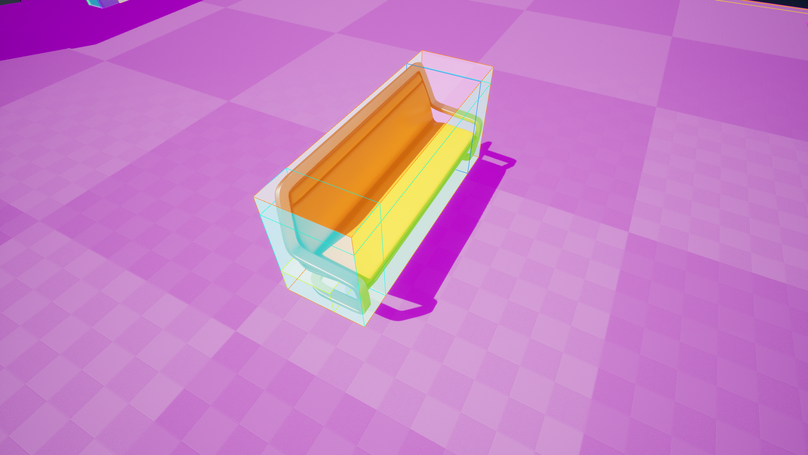
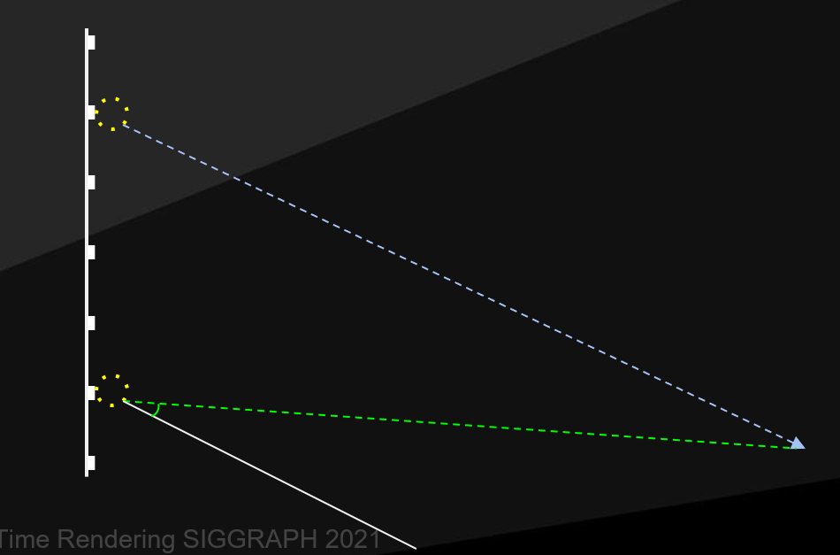
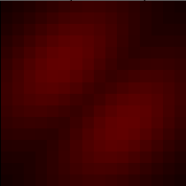
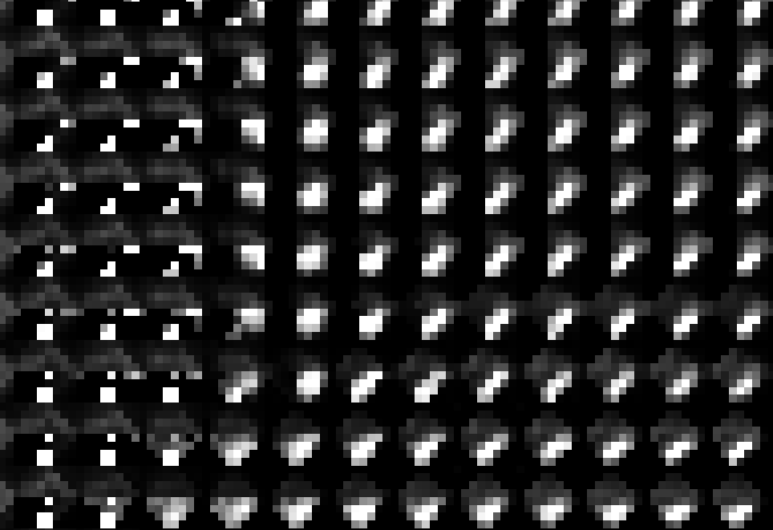
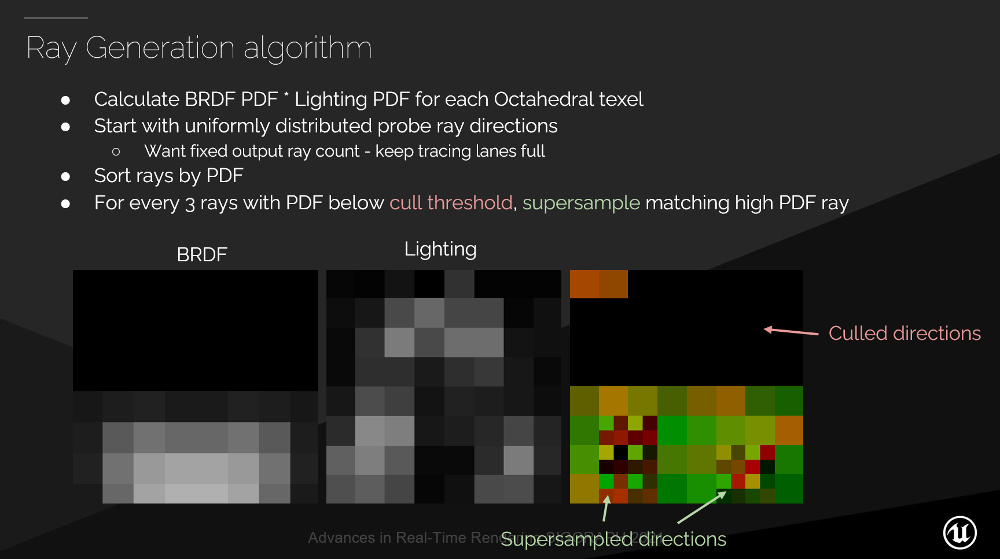
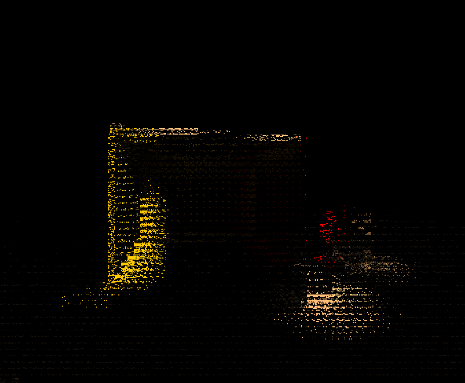
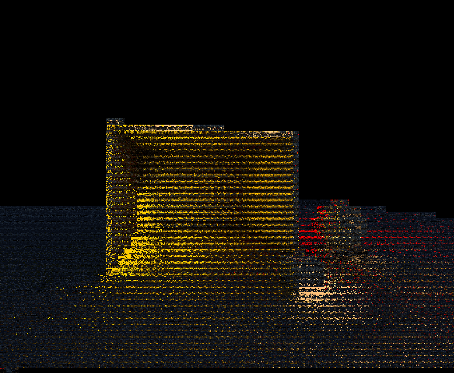
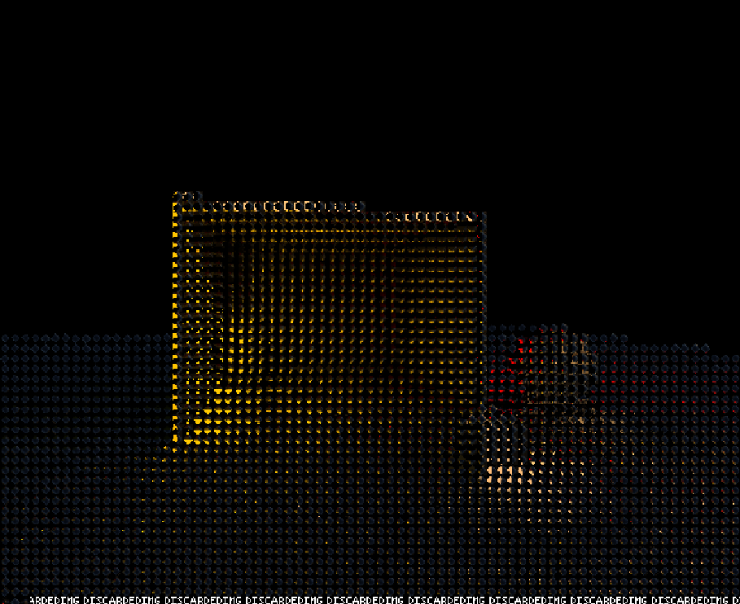

# Lumen

lumen是UE5的次世代动态全局光照方案，其效果非常优秀，质量不逊色于预烘焙的Lightmap，lumen对标的效果应该是传统离线PathTracing，如下对比：

* PathTracing


* Lumen


## 概况
为了接近PathTracing的效果，Lumen采用ScreenSpace Probe来达到细腻的效果，如果单纯使用WorldSpace Probe很难达到这种效果，当然使用ScreenProbe会有很多相关的优化，如Radiance Cache，Sptial/Temporal Filtering，Jitter，Importance Sampling等一系列优化，Tracing部分可以使用Software Tracing或者Hardware Tracing，Software Tracing借助于SDF不受平台硬件限制，Hardware Tracing就需要API支持RayTracing，同时硬件也要支持，所以这也就有了限制，Lumen也花了很大力气来实现Software Tracing。总之Lumen是一套非常复杂的GI系统，内容还有很多如MeshCard，SurfaceCache，Voxel Cone Traicng，WorldSpace Probe...

## Mesh Card
Mesh Card是Lumen里面Mesh的一种表示形式，主要用于后续的SurfaceCache的Capture以及场景Voxelization，Card分布如下



MeshCard会有一个MeshProcessor 'FLumenCardMeshProcessor'，在Mesh加到场景中后会和普通的Mesh走一样额流程生成MeshDrawCommand(FLumenCardVS,FLumenCardPS)。这里会有一个LumenScene来Card和SurfaceCache，相当于FScene的简化版本，但是会有场景的Surface信息。

### Lumen Scene Update
Lumen每帧都会有LumenScene的更新及对应的Surface Cache更新，MeshCard在局部空间是AABB，所以对应Card的位置进行Capture（正交投影），一个MeshCard不会只对应一次Capture，会根据Card在视口中所占屏幕大小算出需要的Texel数量，会根据Texel数量切割多次进行Capture。所有的SurfaceCache都会Atlas到一张大图上这里类似于Virtual Texture。SurfaceCache主要有这几种信息：
* Albedo
* Normal
* Emissive
* DepthStencil

下面是大致的调用流程：
- FDeferredShadingSceneRenderer::BeginUpdateLumenSceneTasks 准备需要Capture的Card
    - UpdateSurfaceCachePrimitives 更新图元
    - UpdateSurfaceCacheMeshCards 更新图元对应的MeshCard
    - FLumenSceneData::ProcessLumenSurfaceCacheRequests 计算CardCapture需要的信息 FCardPageRenderData
        - FLumenSceneData::ReallocVirtualSurface
        - FCardPageRenderData::UpdateViewMatrices 相机会对着MeshCard所在平面拍摄，计算对应的View正交矩阵

- FDeferredShadingSceneRenderer::UpdateLumenScene 发起draw，每帧有最大的调用次数限制，目标RT是Capture Atlas

- FDeferredShadingSceneRenderer::UpdateLumenSurfaceCacheAtlas 把Capture Atlas拷贝到SurfaceCache对应的物理贴图上，并对应进行压缩（BC4/5/6）
    - CompressToSurfaceCacheDepth
    - CompressToSurfaceCacheAlbedo
    - CompressToSurfaceCacheOpacity
    - CompressToSurfaceCacheNormal
    - CompressToSurfaceCacheEmissive
    - CopyCardCaptureLightingToAtlas 根据前一帧的光照信息与当前的Card GBuffer信息计算当前surface上的光照，这个光照计算会在后面解释
        - Lumen.SceneDirectLighting
        - Lumen.SceneFinalLighting
        - Lumen.SceneIndirectLighting
    
经过上面的流程，我们就已经有了基本的场景信息，有了这个信息就可以进行间接光的计算，这也类似于Surfel，只不过Lumen是用新的方式实时计算，场景Surface信息可以动态变化也是纯动态GI的必要条件。通过SurfaceCache和SDF这时候已经可以表达出一个基本场景，如下：

* Lumen Scene


* Final Lit Scene


## Lumen Scene Lighting
有了GI所需的场景信息，下一步就是注入光照信息，这一步就是给SurfaceCache注入光照，同时计算Voxelize场景及Voxel Light。
函数入口：
- FDeferredShadingSceneRenderer::RenderLumenSceneLighting
    - BuildCardUpdateContext
    - RenderDirectLightingForLumenScene
    - RenderRadiosityForLumenScene
    - ComputeLumenSceneVoxelLighting
    - ComputeLumenTranslucencyGIVolume

### BuildCardUpdateContext
GPU上收集需要更新的Card及Tiles

- BuildPageUpdatePriorityHistogramCS 根据Card与相机的关系建立一个直方图
- SelectMaxUpdateBucketCS 对上面的直方图计算前缀和，计算最更新Tiles的最大Index和数量
- BuildCardsUpdateListCS 构建Card更新表，并记录对应信息
- SetCardPageIndexIndirectArgsCS

### RenderDirectLightingForLumenScene
这个步骤是注入直接光和阴影

- Cull Tiles 
    光源对Card切分tile，类似于ClusterLighting
    - SpliceCardPagesIntoTilesCS 对Card进行Light分块，输出需要更新的tile索引表，存储Tile坐标及CardPageIndex相关信息
    - BuildLightTilesCS 对每一个tile进行光源相交检测
    - ComputeLightTileOffsetsPerLightCS 对每个光源对应数量做前缀和
    - CompactLightTilesCS Compact光源数据用于后面的计算
- Shadow map
    借助Virtual Shadow Map给LightTiles计算阴影
- Offscreen shadows
    上面的步骤只是计算了在视口中阴影的影响，但是不在视口中的阴影就需要单独计算，借助SDF进行Trace，从而计算阴影
    - CullDistanceFieldObjectsForLight
        - CullObjectsForShadowCS 以相机为中心200mx200m范围进行剔除
        - ScatterObjectsToShadowTiles 计算每个ShadowTile对应的SDF Objects 
        - ComputeCulledObjectStartOffsetCS 计算每个Tile SDF Objects数据的偏移量
    - DistanceFieldShadowPass
        - DistanceFieldShadowingCS 为每个Tile计算阴影
- Lights
    - FLumenCardDirectLightingPS 为LumenCard注入直接光
- CombineLighting
    结合Albedo，Emissive，DirectLighting及IndirectLighting，最终结果如下：
    


### RenderRadiosityForLumenScene
相当于对SurfaceCache的Radiance收集，以便进行多次反弹（radiance cache）

- BuildRadiosityTilesCS 这个步骤与之前的DirectLight分Tile类似
- LumenRadiosityDistanceFieldTracingCS 这里会为每个Tile Trace一个Probe默认4x4 Texels，根据计算出的方向、ConeHalfAngle并利用SDF进行ConeTrace（采样VoxelLighting），这里的ConeHalfAngle计算：ConeHalfAngle = acosFast(1.0f - 1.0f / (float)(NumTracesPerProbe));
    设半球采样数为$n$，设ConeHalfAngle为$\alpha$，则每个采样Cone的立体角为$\frac{2\pi}{n}$，如下

    $\int^{2\pi}_{0}\int^{\alpha}_{0}sin\theta d\theta d\phi=\frac{2\pi}{n}$

    可以求出$\alpha=acos(1-1/n)$。Probe采样如下：
    

- LumenRadiositySpatialFilterProbeRadiance 为了减少noise，对Atlas Probe进行空间上的Filter，对周围的Probe数据采样并考虑可见性权重
- LumenRadiosityConvertToSH 把当前的Probe（八面体表示）转换为2阶球谐，转换为3张Atlas，分别为RGB通道的SH Coefficients：
    
    
    

- LumenRadiosityIntegrateCS 根据上面的球谐数据计算SurfaceCache的间接光
- CombineLighting 把当前计算出的间接光与之前的直接光结合计算出FinalLight
    

### ComputeLumenSceneVoxelLighting
场景体素化并计算Voxel Lighting，用于Cone Tracing，有比较好的收敛。Lumen的VoxelLighting使用Clipmap方式组织，每个voxel有6个面，Lumen默认可视距离为200米表示为4级clipmap，例如一级clipmap是64x64x64，那么Voxel Volume Texture的尺寸就为64x256x384。

- BuildUpdateGridTilesCS 根据当前场景Mesh的Transform变化对每个Voxel与对应Mesh的Bounds进行相交检测，收集需要更新的Voxel Tiles
- CullToVoxelClipmap Clipmap范围与物体SDF box相交检测，去除不需要的SDF
- SetupVoxelTracesCS 根据物体的AABB与Voxel相交检测，计算需要Trace的Voxel
- VoxelTraceCS 对上面步骤筛选出来的Voxel进行6方向Trace，每个方向默认Trace 64次，不过这里是对单独的Mesh SDF进行Trace
- CompactVisBuffer Compact需要更新的Voxel，这里会统计每个Voxel的每一个面，在上一步VoxelTraceCS中已经确定好数据，这里的Compact以64个Voxel单面为一组
- SetupVisBufferShading 设置IndirectDispatch的arguments
- VisBufferShading 根据前面提供的Voxel位置，面等信息，根据MeshCard从SurfaceCache取数据得到Voxel的光照结果Lighting和不透明度Opacity

Lumen场景的体素化:


### ComputeLumenTranslucencyGIVolume
再议

### 小结
上面是Lumen里的SurfaceCache和VoxelLighting的内容，这里可以看到lumen为了实现多次反弹在SurfaceCache和Voxel中来回取数据，这也是很多实时GI的实现方式，其实有了这些就已经可以满足大多数游戏的GI，但是仅仅使用这些还达不到对标PathTracing的目标，所以之后的过程才是Lumen比较核心的地方，ScreenSpace Probe，这里涉及到很多优化的地方，在Epic的siggraph2021的分享中也着重讲了这一块：**Radiance Caching for real-time Global Illumination (SIGGRAPH 2021)**。

## DiffuseIndirectAndAO
这部分是Lumen最复杂的部分，也是lumen核心部分，这一部分可以结合lumen siggraph分享看，更容易理解。

- LumenScreenProbeGather
    - ScreenProbeDownsampleDepthUniformCS 对SceneRT降采样，默认16x16像素生成一个Probe，并输出Depth，Normal(Octahedron)，Probe Position，Probe Jitter Velocity(用于Temporal Filter)
    - ScreenProbeAdaptivePlacementCS 屏幕空间自适应生成更高精度的Probe，解决Probe之间由于遮挡导致插值不正确的问题，由于Probe之间几何信息可能波动很大，所以就需要生成更高密度的Probe，Lumen中先指定一个高密度的Probe，计算周围的Probe到当前Probe的插值情况，这里对当前Probe所在的位置及法线构建一个平面，计算周围4个Probe距离该平面的距离，计算方式如下：
        ```cpp
        float PlaneDistance; //Depth to the plane
        float SceneDepth; // Depth To camera
        float RelativeDepthDifference = PlaneDistance / SceneDepth;
        float DepthWeight = exp2(-10000.0f * (RelativeDepthDifference * RelativeDepthDifference));
        ```
        DepthWeight随着到Camera距离变远，权重也在变大，也就导致周围的Probe插值权重变高（因为最终是比较周围的权重和是否大于一定阈值，如1.f），当然这里的权重也会加入当前Probe到周围Probe距离的影响。
        如下图：
        

        最终的AdapativeProbe会Altas到同一张Texture中，下图是已经计算过Radiance的：
        

    - ScreenProbeComputeBRDFProbabilityDensityFunctionCS 计算Screen Probe的BRDF PDF，对Screen Probe对应tile的每个像素的法线90度余弦积分的球谐，最终会转成一个3阶球谐
    - World Space Radiance Cache 除了Screen Probe，还有World Space Probe，这里就对Worldspace probe做cache，Radiance Cache也是以Probe形式存在，并且有4级Clipmap
        - MarkRadianceProbesUsedByScreenProbesCS 标记被ScreenProbe使用到的Radiance Probe，同时会随机选取一级Clipmap，并且会同时标记ScreenProbe周围的8个Radiance Probe
        - UpdateCacheForUsedProbesCS 更新Radiance Probe状态，如果标记为需要使用就更新ProbeLastUsedFrame（该Probe上次被使用的帧数），如果超过最大KeepCache的帧数量，就更新ProbeFreeList，用于后面清除Probe数据
        - ClearRadianceCacheUpdateResourcesCS 清除Radiance Probe相关数据
        - AllocateUsedProbesCS 为被使用的Radiance Probe更新状态，更新对应Probe所在Bucket优先级直方图的Trace数量信息，其优先级根据Probe到相机的距离以及Probe上次Trace帧与上次被使用帧之差来决定，大概就是距离越短、帧数差越小优先级越高
        - SelectMaxPriorityBucketCS 从直方图选择权重最高的Bucket
        - AllocateProbeTracesCS 记录需要Trace的Probe位置与Index
        - ComputeProbeWorldOffsetsCS 计算Probe的位置偏移，当Probe过于靠近Surface的时候会做一个适当的偏移，每个会对4x4x4的方向进行检测，应该是为了防止Probe太接近Mesh产生明显的漏光/漏阴影
        - ScatterScreenProbeBRDFToRadianceProbesCS 把之前已经计算好的ScreenProbe BRDF利用到Radiance Probe上
        - GenerateProbeTraceTilesCS
        - RadianceCacheTraceFromProbesCS 实际执行Probe的Trace，利用距离场、VoxelLight、以及之前计算好的需要Trace的信息，输出Probe的Radiance八面体Atlas以及深度的Atlas
        - FilterProbeRadianceWithGatherCS 对已经更新的Probe，执行一次Spatial filtering，输出到一张单独的Texture上，这里会根据当前Probe的前后左右上下6个方向的Probe进行Filter，同时考虑遮挡，其Filter方式大概如下图（本图原本是ScreenProbe得Filter方式，不过World Probe用了相似的方式），实线为当前Probe的方向，蓝色虚线为邻近Probe的同样方向并指向Hit点，绿色虚线为当前Probe到临近Probe Hit点，根据这个夹角计算权重：
        
        - FixupBordersAndGenerateMipsCS 处理八面体的边界（用于插值），并把更新的Probe数据复制到最终的Atlas上
    - GenerateImportanceSamplingRays
        - ScreenProbeComputeLightingProbabilityDensityFunctionCS 根据周围环境的光照亮度计算重要性采样Pdf，这一步就是通过采样之前的RadianceCache计算亮度，从而计算Light的PDF，根据场景亮度进行重要性采样会有更好的收敛效果，注意这里是根据八面体采样，所以不同像素对应的立体角其实是不同的，可参考[OctahedralSolidAngle](https://math.stackexchange.com/questions/3342761/octahedral-facet-solid-angle/3343709#3343709)，如下：
        

            计算结果：
        
        - ScreenProbeGenerateRaysCS 有了PDF就需要生成对应的Ray来进行下一步的Trace，利用之前计算的Probe BRDF PDF和Light PDF生成Probe，下图可以大致的表示其原理，就是根据计算出来的PDF来决定每个Octhedral纹素的采样数量：
        
    - TraceScreenProbes
        - MeshSDFCulling 更新场景需要SDF的数据
        - ScreenProbeCompactTracesCS Compact所有的Trace信息，用于后面直接进行Trace，根据Trace后Hit信息
        - ScreenProbeTraceMeshSDFsCS 进行Surface SDF的Tracing，这里进行的是一定距离的Trace，因为对SurfaceCacheTrace相对来说比较耗，而且当距离变远时，同样立体角对应的区域变大，收敛效果也会变差，该步骤的Trace结果如下：
        
        - ScreenProbeCompactTracesCS 利用MeshSDF进行了一部分Surface的Tracing，有些Texel还没有Trace结果，所以收集这些还未Trace的Texel，用于后面的Voxel Tracing
        - ScreenProbeTraceVoxelsCS 利用Voxel Lighting对远距离的Hit进行Trace，在Voxel Tracing之后的结果：
        
        可以很明显的看到在VoxelTrace后会有更完善的结果
    - FilterScreenProbes
        - ScreenProbeCompositeTracesWithScatterCS 根据Octahedral的立体角计算每个texel的权重，把Trace结果以Octahedral的形式表示，并计算深度，如下：
        
        - ScreenProbeCalculateMovingCS 计算Screen Probe相对于上一帧的移动
        - ScreenProbeTemporallyAccumulateTraceRadianceCS ScreenProbe的时域Filter，主要作用就是结合上一帧的Probe信息做Filter，从而减少Noise，实际上就是反推周围的Probe在上一帧的位置，再采样上一帧的Radiance结果，根据权重进行Filter
        - ScreenProbeFilterGatherTracesCS 空间上的Filter，取当前帧的周围ScreenProbes进行Filter
        - ScreenProbeConvertToIrradianceCS 把Probe从Radiance转到Irradiance
        - ScreenProbeFixupBordersCS 处理Octahedral的边界