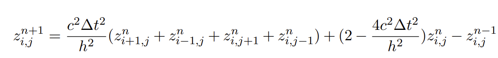
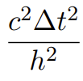
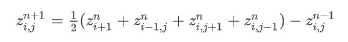
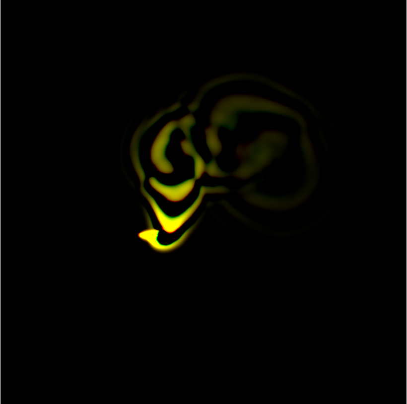
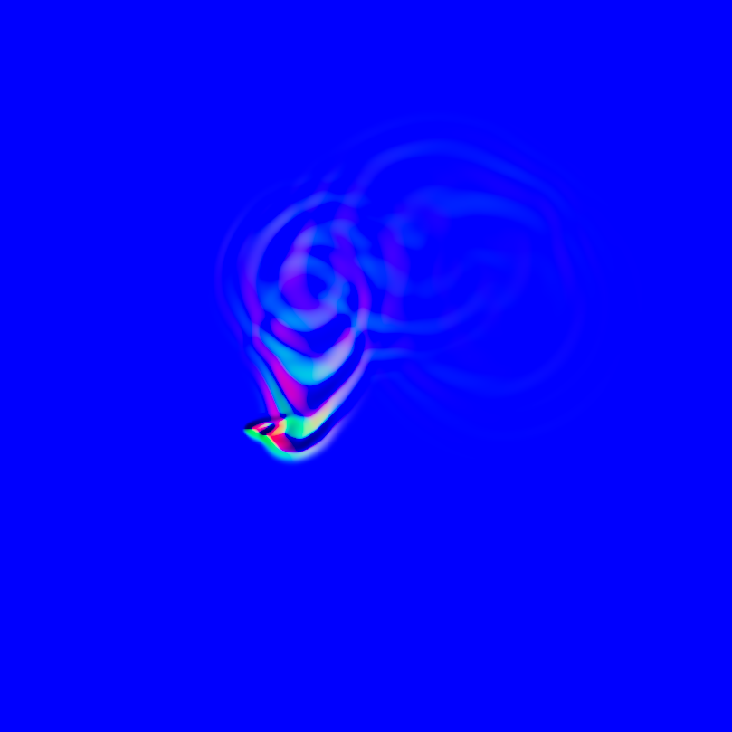
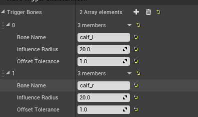
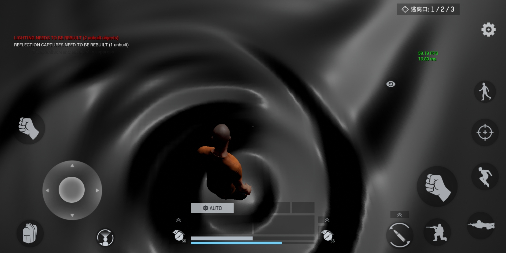
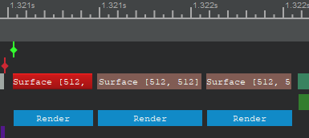
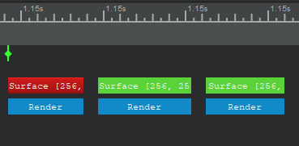

## 技术简介 
* 一般比较复杂的流体模拟需要通过解算N-S方程或者SPH的方式，但是在游戏中，尤其是手游中不可能每帧进行多次迭代（在835平台上迭代8次烟雾流体模拟需要消耗7毫秒的时间，这还不包括后面的RayMarch时间），更不能进行SPH中的物理解算。更重要的是上面的方案只能解算小区域水面，所以这就需要使用简单灵活的方式来计算。
* 本文使用的方案比较简单，就是进行扩散运算。扩散方程就如下：

* z就是水面的高度，上式就需要当前位置高度以及当前位置周围的4个高度和当前位置前一帧的高度。
* n就是当前迭代的次数，n-1就是上一次迭代，n+1就是下一次迭代。
* 把  就看成一个整体，当这个整体值小于等于1/2的时候才会收敛，这里就直接当成1/2就可以了，所以最终的式子会很简洁，如下:

## 实现
### 扩散计算流程
* 计算水面受力点
* 扩散计算，得出结果，高度图
* 计算法线，在游戏中只需要用到法线，所以需要计算法线
### 计算结果
* 下面分别是计算的高度图和法线图

    
    

### 游戏中应用
* 上面的高度图表示的是一片区域，就是围绕着角色进行运动，这个高度图就像滑动窗口一样在水面上移动，并且影响该区域的法线。
* 计算水面位置的法线时只需要人物位置和人物在当前法线贴图的UV位置即可。
* 由于如果应用高度图那么就会大大的增加水面的面数，可能会较大的影响性能，而直接使用法线就不需要增加水面的面数，同时也有不错的表现效果。
* 目前支持SkeletalMesh和StaticMesh对水面的扰动，通过对人物添加WaveTrigger_SkeletalMesh即可，StaticMesh对应的就是WaveTrigger_Static，SkeletalMesh中主要就是通过指定人物的骨骼位置来产生对水面的影响，如下就是设置了两个骨骼点（calf_l，calf_r）对水面产生影响： 

    

### 实际效果

上图只是纯法线的表现，后期还要和美术的水面法线混合

## 性能表现
目前测试是在835平台，渲染目标都是512x512，是比较大的分辨率，实际耗时为1ms左右。实际可以进行减少到256x256，表示的水域小一点，可以进行相应的配置。

* 下图是512x512的耗时统计，3个pass差不多1ms

* 下图是256x256的耗时统计，差不多0.3ms，性能上可以接收，只不过范围会小很多

具体文件在SLInteractiveWater Plugin里