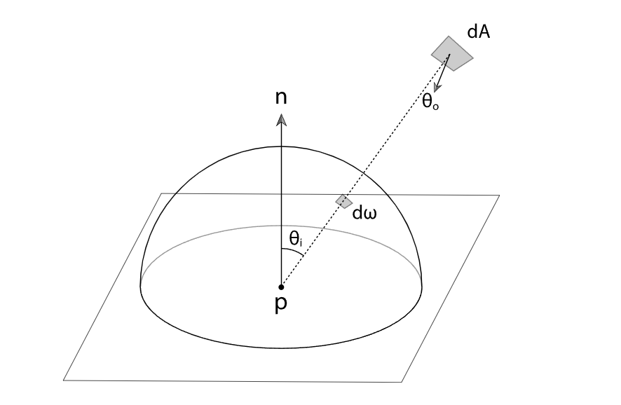
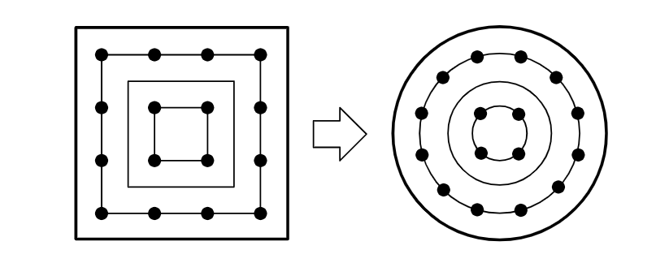
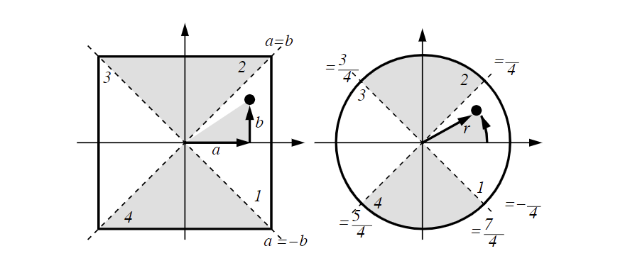
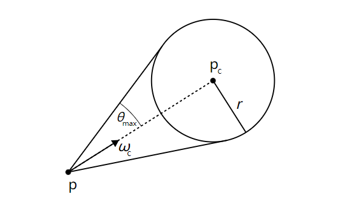
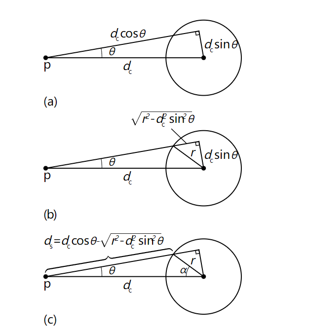

# Path Tracing
前面实现了Volumetric的PRT，但是这只能解决室外的主光和天光，室内的点光、聚光、面光、自发光都需要处理，所以还是需要Irradiance Volume，所以我们的GI就是 **局部光源Irradiance Volume**+**全局光源PRT**。

## 基本概念
这里我们就先了解Diffuse的Path Tracing，因为烘焙光照还不需要用到Specular部分，不过大体差不多，内容也会结合UE4的LightMapPathTracing部分代码来解释。

图形学中要渲染出效果就是根据下面的方程：
$$L_o(p,w_o)=L_e(p,w_o)+\int_{\Omega}f_r(p,w_i,w_o)L_i(p,w_i)n\cdot w_idw_i$$

我们就是需要理解上式中的$f_r(p,w_i,w_o)L_i(p,w_i)n\cdot w_idw_i$，那就需要了解对物理世界中光照度量方法。

## 辐射度量学（Radiometry）
辐射度量学是用来度量电磁场辐射的手段，下面会了解到其中的**辐射能（Radiant energy）**，**辐射通量（Radiant flux）**，**辐射强度（Radiant Intensity）**，**辐照度（Irradiance）**，**辐射率（Radiance）**

### 辐射能（Radiant energy）
光线辐射出来的总能量，一个点光一直向周围发射能量，辐射能用符号$Q$来表示，单位是焦耳$J$

### 辐射通量（Radiant flux）
单位时间内的发射、反射、传播或吸收的辐射能，辐射能用$\Phi$表示，如下：
$$\Phi=lim_{\Delta t \to 0}\frac{\Delta Q}{\Delta t}=\frac{dQ}{dt}$$
单位就是$J/s$，也就是瓦特，单位是$W$

### 辐射强度（Radiant Intensity）
辐射强度指单位立体角的辐射通量，用$I$来表示单位是$W/sr$，这里就需要了解一下立体角，立体角的对应的公式为$\omega = \frac{A}{r^2}$，如下图：

上图是球面上微元面积表示方式，对应灰色部分，$dA=r^2sin\theta d\theta d\phi$，那么$d_\omega$，如下：
$$d_\omega=sin\theta d\theta d\phi$$
$$A=\int_0^{2\pi}\int_{0}^{\pi}dA=4\pi r^2$$
所以整个球对应的立体角为：$\frac{4\pi r^2}{r^2}=4\pi$

由于$$I=\frac{d\Phi}{d\omega}$$
当光源均匀的向每个方向辐射，那么光源的辐射强度：
$$I=\frac{\Phi}{4\pi}$$

可以看到辐射强度与光线传播距离无关。

### 辐照度（Irradiance）
单位面积接收到的辐射通量，用$E$表示，单位是$W/m^2$：
$$E=\frac{d{\Phi}}{dA}$$
辐照度的计算也会遵循Lambert的余弦定律，物体表面吸收的辐射通量与光线入射角度余弦成比例，这就牵扯到虚拟平面，

假设光线与平面法线的夹角为$\theta$：
$$E=\frac{d\Phi}{dA}=\frac{d\Phi}{dA^{\bot}}cos\theta$$

如果光源从各个方向均匀辐射，那么球面上一点的辐照度就为：$E=\frac{\Phi}{4\pi r^2}$，由此可知辐照度和距离的平方成正比。

### 辐射率（Radiance）
单位面积下接受到来自单位立体角的辐射通量，常用$L$表示，单位是$W/sr\cdot m^2$，一个微小平面$dA$接收到微分立体角$d\omega$的辐射通量$d\Phi$，辐射率为：
$$L(p,\omega)=\frac{d^2\Phi(p,\omega)}{d\omega dAcos\theta}$$
这里需要除以$cos\theta$是因为这里的$\Phi$是经过投影后的值，在上面可知是乘了$cos\theta$，但是这里需要投影前的值，所以需要除以$cos\theta$。当立体角足够小就可以表示为一个方向，当面积足够小，就可以表示一个点，即式子中的$p$，那么可以用辐射率代表单束光线从某个方向射向某个位置的能量。

假设一条光线的辐射率为$L(p,\omega)$，那么$\omega$方向上对点$p$的贡献的辐照度$dE(p,\omega)$就如下：
$$dE(p,\omega)=L(p,\omega)n\cdot \omega d\omega$$

如果只有一条光线，那么$E(p)=dE(p,\omega)$，所以当游戏中计算直接光的时候就十分简单，但是实际物理世界中各个方向都有光照贡献，可以有如下表示：
$$E(p)=\sum dE_i(p,\omega_i)=\sum L_i(p,\omega_i)n\cdot w_id\omega_i$$
这实际上就是上半球的积分了：
$$E(p)=\int_{\Omega}L_i(p,\omega_i)n\cdot \omega_id\omega_i$$
这里实际上已经和最终的公式差不多了，只是差了一个$f_r(p,\omega_i,\omega_o)$，也就是BRDF

### 双向分布反射函数（BRDF）
BRDF决定了物体的材质，这里先处理漫反射，所以BRDF就是$1/\pi$

### 蒙特卡洛积分
对上半球积分是个很复杂的事情，如果要做到离散化积分同时要保证收敛速度，这里就需要蒙特卡洛积分，这里就需要了解**概率密度函数（PDF）**，对于任意一个连续性随机变量，假设$PDF$为$f(x)$，那么他就满足下面的性质$\int f(x)dx=1$，最终公式为：
$$\int_a^bf(x)dx=\frac{1}{n}\sum_{i=1}^{n}\frac{f(x_i)}{p(x_i)}$$

## Path Tracing
结合前面的信息可以使用蒙特卡洛公式表示：
$$L_o(o,\omega_o)=\int_{\Omega}f_r(p,\omega_i,\omega_o)L_i(p,\omega_i)n\cdot \omega_i d\omega_i=
\frac{1}{n}\sum_{i=1}^{n}\frac{f_r(p,\omega_i,\omega_o)L_i(p,\omega_i)n\cdot \omega_i}{p(x)}$$

如果是均匀采样，那么这里的pdf就是$p(x)=1/2\pi$，实际上会进行**重要性采样**，所以pdf会根据brdf的不同来决定。

如果每次bounce都进行半球积分，那会导致光线数量指数型暴涨，100->10000...所以就每次反弹只发射一条光线，但是可以在像素发射多条光线。

### 俄罗斯轮盘赌（Russian Roulette）
由于上述PathTracing会有无限递归的问题，所以需要在反弹次数达到一定次数后就停止。所以就需要使用俄罗斯轮盘赌以一定的概率结束递归，并且保证期望一致。比如我们每次以$p$的概率发射光线，则会有$p$的概率发射光线，然后把结果除以$p$，即$\frac{L_o}{p}$，$1-p$的概率不发射光线，结果就是0。
$$E=\frac{L_o}{p}*p+0*(1-p)=L_o$$
所以结果还是符合期望的，只要计算出的结果除以概率$p$就行了，很简单。

## Next Event Estimation(NEE)
上面的计算都是从相机发射光线，不考虑场景光源，那么如果光源比较小，那么就很难与光源相交，所以收敛就会很慢。这个时候就需要同时对光源进行采样，这里就是用NEE的方式。

### 基本原理
由于我们已知光源的位置信息，这里同时进行两种采样，BRDF和光源采样，这两者都进行了重要性采样，如下图：

NEE就是在目标点计算光照的时候加入光源对该点的影响，下图一个场景，人眼看到一个点（微元面积），这个点是由各个方向的光线产生贡献：

下图是直接光和间接光区域划分：

所以在每个点使用光源采样来获取直接光影响，通过BRDF进行间接光方向的创建，如下就是一个3次反弹的流程：

但是如果纯按照上面的方式会造成场景过亮，造成这样的原因是，有些情况下间接光采样方向打到光源上，所以就导致光源有了两次采样，这就导致过亮，其实这也可以理解为光照强度翻倍，可以直接除以2，当然只有在第一次反射才会除2，如下图：

### Multiple Importance Sample(MIS)
由于我们使用了光源采样和BRDF采样，所以这里就需要进行多重重要性采样来保证收敛速度，下面有几种MIS方式：
* 平均：$w_i(x)=\frac{1}{N}$，对N个方法进行平均
* 1或0，基于每个采样结果
* [Balance heuristic](https://www.pbr-book.org/3ed-2018/Monte_Carlo_Integration/Importance_Sampling)，$$w_i(x)=\frac{p_i(x)}{\sum_{k=0}^N pk(x)}$$

使用Balance heuristic的方式比0/1的方式收敛更快，噪点更少。

使用0/1方式也可以，很粗暴，只在第一次反弹在光源上时计算直接光BRDF的采样，其余反弹如果在光源上就直接记为0。

但是直接使用0/1方式在一些光照环境下效果会出错，比如小面光和大面光会出现噪点比较多的情况，所以使用**Balance heuristic**是更好的方式。
使用**Balance heuristic**需要注意如下几点：
* 每次反弹都需要同时考虑两种光源采样。
* 第一次反弹的BRDF权重始终是1。
* 计算两种采样技术的可能性，并且使用**Balance heuristic**来计算MIS权重。

正常计算Path Tracing是一个递归过程，但是在Shader中一般使用循环代替，这就需要拆出一些分量出来，一般称之为**Throughput**，UE中分为两部分，一部分是BRDF的就是$DiffuseColor/\pi$，还有一部分就是PDF表示为$\frac{N\cdot R}{\pi}$。

## Light Sample
光源采样也是很重要的一部分，场景中有各种各样的光源，比如平行光，面光，点光，聚光。每一种光源都对应一种采样方式，详细内容可以在这篇教程里找到[Light Sample](https://pbr-book.org/3ed-2018/Light_Transport_I_Surface_Reflection/Sampling_Light_Sources)。

### Sampleing Shapes
对一个Shape采样，可以使用以均匀概率进行采样，也可以以一定的参数进行采样。这里主要讨论概率密度（PDF），由立体角定义可知$\omega=\frac{A}{r^2}$，所以可以引申出$d\omega=\frac{dAcos\theta}{r^2}$，至于这里为什么会有一个$cos\theta$，下图：

上图中，灰色部分就是光源，如果计算该光源对p点贡献的积分，可得如下公式：
$$E(p,n)=\int_A Lcos\theta_i \frac{cos\theta_odA}{r^2}$$

$\theta_i$是shading位置的法线和位置p到光源上的随机点p'方向的夹角，$\theta_o$是p'到p的方向与光源上点p'处的法线的夹角，所以这里的$d\omega_i$可以表示为如下：
$$\frac{d\omega_i}{dA}=\frac{cos\theta_o}{r^2}$$
这里$\omega_i$是光源到shading点的入射方向。

计算PDF的时候会把立体角考虑进去，所以再加入立体角因素，可以得到$d\omega_i=\frac{dA cos\theta_o}{r^2}$，所以$pdf=\frac{r^2}{dA cos\theta_o}$。

### Sampling Disks
对Disk采样可以近似理解为对太阳采样，要在Disk上均匀采样一点需要介入**Concentric Mapping**，这可以保证采样出来的点是均匀分布的，对应的[Paper](https://paperzz.com/doc/8612181/a-low-distortion-map-between-disk-and-square)。

其本质上就是现在正方形区域均匀采样，然后再把正方形转换成圆形，如下图：

对应的点转换方式如下图：

把两个随机$a,b$数映射到[-1,1]，所以转化关系为：
$$r=a$$
$$\phi = \frac{\pi}{4}\frac{b}{a}$$
其中$\phi \in[- \frac{\pi}{4},\frac{\pi}{4}]$

### Sampling Triangles

### Sampling Spheres
球面采样很容易，可以在球面随机均匀采样点，但是更好的方法是只采对当前点有贡献的部分，比如那些背面的部分就可以不进行采样，这也就提高了采样效率，加快收敛。

如果已知一点p，一个Sphere光源$p_c$，其可采样区域如下：

这里可以求出最大夹角$\theta_{max}$，对其采样需要两个角度值$(\theta,\phi)$，这里$\phi\in[0,2\pi]$，$\theta\in[0,\theta_{max}]$，要求出球面点到球面中心点的方向，有如下关系：

这里就是为了求出$\alpha$，这里需要用到余弦定理：$$c=\sqrt{a^2+b^2-2ab\cdot cos\gamma}$$
c：三角形c边长度

a：三角形a边长度

b：三角形b边长度

$\gamma$：朝向c边的角度

所以可得$$d_s^2=d_c^2+r^2-2d_crcos\alpha$$
$$cos\alpha=\frac{d_c^2+r^2-d_s^2}{2d_cr}$$

有了$\alpha$和已知的$\phi$可以很容易的求出方向，还有一点就是求PDF，对这个部分求pdf要首先得出该区域的立体角，根据立体角的计算方法$d\omega=sin\theta d\theta d\phi$，所以表示为：
$$1=c\int_0^{2\pi}\int_0^{\theta_{max}}sin\theta d\theta$$
$$1=c(2\pi(1-cos\theta_{max}))$$

所以$pdf=\frac{1}{2\pi(1-cos\theta_{max})}$。

### Sampling Spheres

上面都是一些理论上的解释，但是UE4在PathTracing的实现中并没有按照这些理论来，使用了很直接的Pdf，