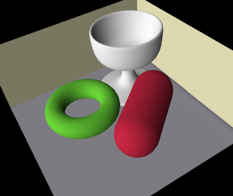
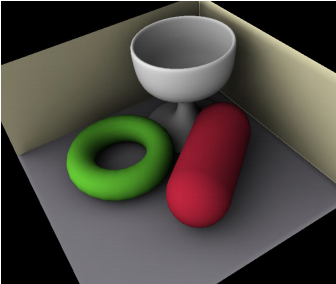
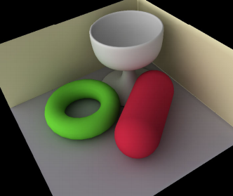
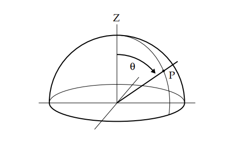
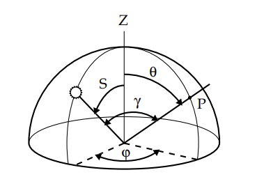

# Precomputed Radiance Transfer
## 球谐光照（Spherical Harmonic Lighting）
首先要先理解球谐光照，球谐光照就是首先Capture光照，然后在runtime时Relight，通常只要几个系数就可以表示一个球面的低频光照信息。

## 蒙特卡洛积分
设变量$x$服从概率密度函数$p(x)$，函数$f(x)$的数学期望就是：

$$E[f(x)]=\int f(x)p(x)dx$$

积分式$I=\int f(x)dx$可以有下面的变形：

$$I=\int \frac{f(x)}{p(x)}p(x)dx=E[\frac{f(x)}{p(x)}]$$

可以通过近似方法得到：

$$I=E[\frac{f(x)}{p(x)}]\approx\frac{1}{N}\sum_{i=1}^{N}\frac{f(x^i)}{p(x^i)}$$

意思就是随机均匀选取一些采样点

我们这里需要对球面进行积分，所以需要有均匀的随机变量，所以$\theta,\phi$如下：
球面上的面积微元$d_A$里的采样概率：
$$P_A=p(v)dA=\frac{1}{4\pi}dA$$
$$d_A=sin\theta d\theta d\phi$$
参数化概率密度函数为：
$$p(\theta,\phi)=\frac{1}{4\pi}sin\theta$$
求两个二维独立随机变量的概率密度函数的边缘密度函数：
$$f(\theta)=\int_{0}^{2\pi}p(\theta,\phi)d\phi=\frac{sin\theta}{2}$$
$$f(\phi)=\int_{0}^{\pi}p(\theta,\phi)d\theta=\frac{1}{2\pi}$$
再来一次边缘密度函数：
$$F_\theta(\theta)=\int_0^{\theta}f(\hat\theta)d\hat{\theta}=\frac{1-cos\theta}{2}$$
$$F_\phi(\phi)=\int_{0}^{\phi}f(\hat\phi)d\hat{\phi}=\frac{\phi}{2\pi}$$

求反函数：

$$
\begin{cases}
\theta=2arccos(\sqrt{1-\xi_x})\\
\phi=2\pi\xi_y
\end{cases}
$$

## 球谐函数
Spherical Harmonics中的Harmonics一般译为调和，就是“谐波”的意思。Harmonics一般就是拉普拉斯方程（Laplace's Equation）的解，解也一般含有$sin$和$cos$。在傅里叶分析里面，把单位圆上的周期函数用调和函数展开，再拓展到n维球面，就会得到球面调和（Spherical Harmonics）。

### 函数正交
傅里叶变换里的函数基底就是谐波$sin(nx)$和$cos(nx)$。这些基底函数一般就是正交函数。两个正交函数在定义域里内积为0：$\int f(x)g(x)d_x=0$。

### 勒让德多项式
正交多项式（Orthogonal Polynomial），如下特性：
$$
\int _{-1}^{1}F_m(x)F_n(x)dx=
\begin{cases}
0 (n\neq m)\\
c (n=m)
\end{cases}
$$

当$c=1$时就是标准正交。勒让德多项式（Legendre Polynomial）就是其中的一种。球谐光照里最为关注勒让德微分方程（Associated Legendre Polynomial）也称为ALP，勒让德函数就是勒让德微分方程的解：

$$(1-x^2)=\frac{d^2P(x)}{dx^2}-2x\frac{dP(x)}{dx}+n(n+1)P(x)=0$$

在试图球面坐标求解三维拉普拉斯方程时，问题就会归结为勒让德方程的解。

当$n\in Z^*$，$x=\pm1$时也有解，这样由正交多项式组成的多项式序列成为勒让德多项式：
$$P_n(x)=\frac{1}{2^n\cdot n!}\frac{d^n}{dx^n}[(x^2-1)^n]$$

伴随勒让德多项式就可以根据普通勒让德多项式$P_n(x)$来定义：
$$P_l^m=(-1)^m(1-x^2)^{m/2}\frac{d_m}{dx^m}(P_l(x))$$

### 球谐函数
单位球面参数化：
$(sin\theta cos\phi,sin\theta sin\phi,cos\theta)->(x,y,z)$

三维空间中的拉普拉斯算子可以表示为：
$$\nabla ^2=\frac{\partial ^2}{\partial x^2}+\frac{\partial ^2}{\partial y^2}+\frac{\partial ^2}{\partial z^2}=0$$

球面坐标代入拉普拉斯方程：
$$\frac{1}{r^2}\frac{\partial}{\partial r}(r^2\frac{\partial f}{\partial r})+\frac{1}{r^2sin\theta}\frac{\partial}{\partial \theta}(sin\theta\frac{\partial f}{\partial \theta})+\frac{1}{r^2sin^2\theta}\frac{\partial^2f}{\partial \phi^2}=0$$

为了求拉普拉斯的解把距离变量$r$和方向变量$\theta$和$\phi$分离，如下：
$$f(r,\theta,\phi)=R(r)Y(\theta,\phi)$$

代入到拉普拉斯方程中得到：
$$\frac{Y}{r^2}\frac{\partial}{\partial r}(r^2\frac{\partial R}{\partial r})+\frac{R}{r^2sin\theta}\frac{\partial}{\partial \theta}(sin\theta\frac{\partial Y}{\partial \theta})+\frac{R}{r^2sin^2\theta}\frac{\partial^2Y}{\partial \phi^2}=0$$

两边同时乘以:
$$\frac{r^2}{RY}$$
得:
$$\frac{1}{R}\frac{\partial}{\partial r}(r^2\frac{\partial R}{\partial r})=\frac{1}{Ysin\theta}\frac{\partial}{\partial \theta}(sin\theta\frac{\partial Y}{\partial \theta})-\frac{1}{Ysin^2\theta}\frac{\partial^2Y}{\partial \phi^2}$$

可以看到等式左边只和$r$有关，右边只和$\theta$，$\phi$相关，两边相等不可能，除非等于一个常数，这个常数记为$l(l+1)$：

$$\frac{1}{R}\frac{\partial}{\partial r}(r^2\frac{\partial R}{\partial r})=\frac{1}{Ysin\theta}\frac{\partial}{\partial \theta}(sin\theta\frac{\partial Y}{\partial \theta})-\frac{1}{Ysin^2\theta}\frac{\partial^2Y}{\partial \phi^2}=l(l+1)$$

继续分解为下面得等式：
$$\frac{\partial}{\partial r}(r^2\frac{\partial R}{\partial r})-l(l+1)R=0$$
$$\frac{1}{sin\theta}\frac{\partial}{\partial \theta}(sin\theta\frac{\partial Y}{\partial \theta})+\frac{1}{sin^2\theta}\frac{\partial^2Y}{\partial \phi^2}+l(l+1)Y=0$$

由于只和角度相关，所以方程也称为球函数方程：
$$Y(\theta,\phi)=\Theta(\theta)\Phi(\phi)$$

带入球函数方程：
$$\frac{\Phi}{sin\theta}\frac{\partial}{\partial \theta}(sin\theta\frac{\partial \Theta}{\partial \theta})+\frac{\Theta}{sin^2\theta}\frac{\partial^2\Phi}{\partial \phi^2}+l(l+1)\Theta\Phi=0$$

两边乘以：
$$\frac{sin^2\theta}{\Theta\Phi}$$
得：

$$\frac{sin\theta}{\Theta}\frac{\partial}{\partial \theta}(sin\theta\frac{\partial \Theta}{\partial \theta})+l(l+1) sin^2\theta=-\frac{1}{\Phi}\frac{\partial^2\Phi}{\partial \phi^2}$$

左边是$\theta$得函数，跟$\phi$无关，右边是$\phi$相关得，所以相等不可能，除非是个常量，记为$\lambda$：

$$\frac{sin\theta}{\Theta}\frac{\partial}{\partial \theta}(sin\theta\frac{\partial \Theta}{\partial \theta})+l(l+1) sin^2\theta=-\frac{1}{\Phi}\frac{\partial^2\Phi}{\partial \phi^2}=\lambda$$

又拆解成两个常微分方程：
$$\frac{\partial^2\Phi}{\partial \phi^2}+\lambda \Phi=0$$
$$\sin\theta\frac{\partial}{\partial \theta}(sin\theta\frac{\partial \Theta}{\partial \theta})+[l(l+1) sin^2\theta-\lambda]\Theta=0$$

对于常微分方程，有一个隐含得“自然周期条件”，$(\Phi(\phi+2\pi)=\Theta(\phi))$，两者构成本征值（特征值）问题，即：
$$\lambda=m^2,(m=0,\pm1,\pm2...)$$

其周期解得复数形式为：
$$\Phi(\phi)=e^{im\phi},m=0,\pm1,\pm2...$$

$$cosm\phi+isin m\phi=e^{im\phi}$$

可以把上面得常微分方程改成：
$$\frac{1}{sin\theta}\theta\frac{\partial}{\partial \theta}(sin\theta\frac{\partial \Theta}{\partial \theta})+[l(l+1) sin^2\theta-\lambda]\Theta=0$$

令$x=cos\theta$则：
$$\frac{\partial\Theta}{\partial\theta}=\frac{\partial\Theta}{\partial x}\frac{\partial x}{\partial\theta}=-sin\theta\frac{\partial\Theta}{\partial x}$$

代入上面得常微分方程可得：
$$(1-x^2)\frac{\partial^2\Theta}{\partial^2x}-2x\frac{\partial\Theta}{\partial x}+[l(l+1)-\frac{m^2}{1-x^2}]\Theta=0$$

上述得方程就是**I次连代勒让德方程**，当$m=0$时的特例就是：
$$(1-x^2)\frac{\partial^2}{\partial x^2}-2x\frac{\partial \Theta}{\partial x}+l(l+1)\Theta=0$$

称为**I次勒让德方程**

后面只考虑连带勒让德方程，它的解就称为**连带勒让德函数**，只有当$\lambda=l(l+1),l=0,1,...$时有周期解，用$P_l^m(x)$表示，*这里把$x$替换成$cos\theta$*，即
$$\Theta(\theta)=P_l^m(cos\theta)\space\{m=0,\pm1,...,\pm l\}$$

连带勒让德函数（连带勒让德方程的解）表示为：
$$P_l^m(x)=\frac{(-1)^m(1-x^2)^{\frac{m}{2}}}{2^ll!}\frac{d^{l+m}}{dx^{l+m}}(x^2-1)^l$$

上面就是l次m阶连代勒让德函数，当$m>l$，连带勒让德函数里面有一个$m+l$（上式内容$\frac{d^{l+m}}{dx^{l+m}}(x^2-1)^l$）次导数计算，在计算机上很难处理，但是有递归关系，如下：
$$
\begin{cases}
(l-m)P_l^m(x)=x(2l-1)P_{l-1}^m(x)-(l+m-1)P_{l-2}^m(x)\\
P_m^m(x)=(-1)^m(2m-1)!!(1-x^2)^{m/2}\\
P_{m+1}^m(x)=x(2m+1)P_m^m(x)
\end{cases}
$$
$!!$表示双阶乘，即$(2m-1)!!=1\cdot3\cdot5\cdot\cdot\cdot(2m-1)$

l次m阶连带勒让德函数得关系等式：
$$P_l^m(x)=(-1)^m\frac{(l+m)!}{(l-m)!}P_l^{-m}(x)$$

代入到球函数中，它的$Y(\theta,\phi)$的通解复数形式（结合前面的$\Phi(\phi)=e^{im\phi}$）表示为：
$$Y(\theta,\phi)=\sum^{\infty}_{l=0}\sum^{l}_{k=-l}P_l^k(cos\theta)e^{im\phi},m=0,\pm1,\pm2,...$$

一般得l次m阶球谐函数$Y_{lm}(\theta,\phi)$的复数形式可以表示为：
$$Y_{lm}(\theta,\phi)=P_{lm}(cos\theta)e^{im\phi},m=0,\pm1,\pm2,...$$

球谐函数的模长表示为：
$$(N_l^m)^2=\iint_SY_{lm}(x)[Y_{lm}(x)]^*sin\theta d\theta d\phi=\frac{2}{2l+1}\frac{(l+|m|)!}{(l-|m|)!}2\pi$$

归一化球谐函数$Y_l^m(\theta,\phi)$的复数形式表示为：
$$Y_l^m(\theta,\phi)=K_l^mY_{lm}(\theta,\phi)$$

其中$K_l^m$表示为：
$$K_l^m=\frac{1}{N_l^m}=\sqrt{\frac{2l+1}{4\pi}\frac{(l-|m|)!}{(l+|m|)!}}$$

其中$Y_{lm}(\theta,\phi)$表示一般形式的球谐函数，$Y_l^m(\theta,\phi)$表示归一化球谐函数。

球谐函数的实数表现形式，当$m>0$时采用实数$cos$部分，当$m<0$时采用虚数$sin$部分，归一化的球谐函数的实数表现形式为：
$$Y_l^m(\theta,\phi)=
\begin{cases}
\sqrt{2}K_l^mcos(m\phi)P_l^m(cos\theta)\space m>0\\
\sqrt{2}K_l^msin(-m\phi)P_l^{-m}(cos\theta)\space m<0\\
K_l^0P_l^m(cos\theta)\space m=0
\end{cases}
$$

根据上面的公式就可以推导出球谐函数。

### 球谐性质

* 正交完备性
* 旋转不变性

#### 正交完备性
任意两个归一化的球谐函数在球面上的积分有：
$$\iint_S Y_l^m(\theta,\phi)Y_k^n(\theta,\phi)sin\theta d\theta d\phi=
\begin{cases}
0 \space m\neq n,l\neq k\\
1 \space m=n,l=k
\end{cases}
$$

这就表示由球谐函数构成的函数组$\{Y_l^m(\theta,\phi)\}$是正交归一化的。

以某一正交归一函数组为基，把一个给定的函数用这个函数以线性组合来表示，这是一种重要的展开，一个著名的例子就是傅里叶变换。

任意一个球面函数$f(\theta,\phi)$可以用正交归一的球函数$Y_l^m(\theta,\phi)$进行展开，这种展开就是类似于傅里叶展开，称为**广义傅里叶展开**：
$$f(\theta,\phi)=\sum^\infty_{l=0}\sum^l_{m=-1}C_l^mY_l^m(\theta,\phi)$$

其中**广义傅里叶系数**$C_l^m$为：
$$C_l^m=\int_0^{2\pi}\int_0^{\pi}f(\theta,\phi)Y_l^m(\theta,\phi)sin\theta d\theta d\phi$$
当$l\to\infty$时，展开级数和会平均收敛于$f(\theta,\phi)$，也就是当$l$越大，级数和就会越趋近于被展开的函数$f(\theta,\phi)$。平均收敛并不代表收敛只是趋近的含义。
$n$的取值不可能无限大，一般就是取固定系数如$n=2$，如下：
$$\{Y_l^m(\theta,\phi)\}=\{Y_0^0,Y_1^{-1},Y_1^0,Y_1^1\}$$

给定系数$n$，得到的球谐函数组的个数就为$n^2$
广义傅里叶系数相当于这样的排列：
$$C_0^0,C_1^{-1},C_1^0,C_1^1,C_2^{-2}...$$

用一个系数$c_k$来表示上面的广义傅里叶系数，用函数$y_k(\theta,\phi)$来表示球谐函数，可以换成如下形式：
$$f(\theta,\phi)=\sum_{k=0}^{n^2-1}c_ky_k(\theta,\phi)$$

球谐函数相当于正交基，将函数$f(\theta,\phi)$表示为这组正交基的线性组合，生成线性组合系数的过程就是**投影**。相反，利用这组系数和正交基组合。得到函数的过程就是**重建**。投影就相当于计算函数积分，计算消耗大，一般离线处理。但是在实时中可以快速重建原始函数。

#### 傅里叶级数（Fourier Series）
任意周期的函数都可以写成三角函数之和，傅里叶级数就是通过三角函数和常数项来叠加逼近周期为T的函数$f(x)$，任何周期函数都可以看成是不同振幅，不同相位正弦波叠加。
傅里叶级数就是向量，如下：
$$f(x)=a_0+\sum^\infty_{n=1}(a_ncos(\frac{2\pi n}{T}x)+b_nsin(\frac{2\pi n}{T}x))$$

上面实际上就是把$f(x)$当作如下基的向量：
$$\{1,cos(\frac{2\pi n}{T}),sin(\frac{2\pi n}{T}x)\}$$

为了求基的系数，可以两边同时乘以$cosnx$，如下：
$$\int_{-\pi}^{\pi}f(x)cosnxdx=a_0\int_{-\pi}^{\pi}cosnxdx+\sum_{n=1}^{\infty}a_n\int_{-\pi}^{\pi}cosnxcosnxdx+\sum_{n=1}^{\infty}b_n\int_{-\pi}^{\pi}sinnxcosnxdx$$

由于不同向量是正交的（周期内积分为0），所以非零项只有$\sum_{n=1}^{\infty}a_n\int_{-\pi}^{\pi}cos^2nxdx$，$a_n\int_{-\pi}^{\pi}cos^2nxdx=\pi a_n$也就得到：
$$an=\frac{1}{\pi}\int_{-\pi}^{\pi}f(x)cosnxdx$$

可以用下面的方式表示：
$$an=\frac{<f(x),cosnx>}{<cosnx,cosnx>}$$

时域就是我们正常看到的波形。

正弦波其实就是一个圆周运动在一条直线上得投影，频域得基本单元可以理解为一个始终在旋转得圆：


那么多个正弦波叠加情况就如下动图：


至于频域的表示，横轴就是正弦波函数，也就是基，纵轴（高度）就是振幅，也就是向量：


在频域分析中振幅、频率、相位缺一不可，不同相位决定了波的位置，首先要直到时间差，时间差就是距离频率轴最近的波峰的距离，相位差就是时间差在一个周期里的比例，并乘以2PI。

#### 傅里叶变换（Fourier Transformation）
上面说的傅里叶级数是时域周期且连续的函数，频域是一个非周期离散函数。
傅里叶变换就是把一个时域非周期的连续信号转换为一个频域非周期的连续信号。

之前的区间都是$[-\pi,\pi]$，这里需要把区间换成$[-a,a]$，相当于把函数和基都拉伸了$a/\pi$倍，基也就变成了：
$$\{1,sin\space nwx,cos\space nwx\},\{exp(inwx)\},w=\frac{\pi}{a}$$

傅里叶级数也让就变成了如下：
$$f(x)=a_0+\sum_{n=1}^{\infty}a_ncos\space nwx+b_nsin\space nwx ,or \space f(x)=\sum_{n=-\infty}^{\infty}c_nexp(inwx)$$

* 区间变成$[-a,a]$后，两边同时乘以$exp(-inwx)$，并在$[-a,a]$上积分，傅里叶系数就变为:
  $$\int_{-a}^{a}f(x)exp(-inwx)dx=\sum_{n=-\infty}^{\infty}\int_{-a}^{a}c_nexp(inwx)exp(-inwx)dx$$
  $$c_n=\frac{1}{2a}\int_{-a}^{a}f(t)exp(-in\pi t/a)dt$$
* 把傅里叶系数代入到$f(x)$中，得到：
  $$f(x)={lim}_{a\to\infty}[\sum_{n=-\infty}^{\infty}(\frac{1}{2a}\int_{-a}^{a}f(t)exp(-in\pi t/a)dt)exp(in\pi x/a)]$$
* 上式积分是与$t$相关的，外部的项$exp(in\pi x/a)$与$t$无关，可以写成：
  $$f(x)={lim}_{a\to\infty}[\sum_{n=-\infty}^{\infty}\frac{1}{2a}\int_{-a}^{a}f(t)exp(in\pi(x-t)/a)dt]$$
* 为了凑出黎曼和，令$\lambda_n=\frac{n\pi}{a},\Delta\lambda=\lambda_{n+1}-\lambda_{n}=\frac{\pi}{a}$，代入上式：
  $$f(x)={lim}_{a\to\infty}[\sum_{n=-\infty}^{\infty}\frac{1}{2\pi}\int_{-a}^{a}f(t)exp(i\lambda_n(x-t))dt]\Delta\lambda$$
* 当$a\to\infty$时，$\Delta\lambda\to 0$，由于是[黎曼和](https://zh.wikipedia.org/wiki/%E9%BB%8E%E6%9B%BC%E7%A7%AF%E5%88%86)的形式上式可以写成定积分：
  $$f(x)=\frac{1}{2\pi}\int_{-\infty}^{\infty}[\int_{-\infty}^{\infty}f(t)exp(i\lambda(x-t))dt]d\lambda$$
* 上式变形可得：
  $$f(x)=\frac{1}{\sqrt{2\pi}}\int_{-\infty}^{\infty}(\frac{1}{\sqrt{2\pi}}\int_{-\infty}^{\infty}f(t)exp(-i\lambda t)dt)exp(i\lambda x)d\lambda$$


在$a\to\infty$下，本质上还是求和式，因为极限写成了积分，这里把$f(x)$写成了$exp(i\lambda x)d\lambda$的线性组合。这里的变量$\lambda$是取遍整个数轴的，数轴上每个点都对应函数的一个基。括号里的内容就是函数的傅里叶变换：
$$\hat{f(x)}=\frac{1}{\sqrt{2\pi}}\int_{-\infty}^{\infty}f(t)exp(-i\lambda t)dt$$
这个函数的意义：在$\lambda$处的函数值$\hat{f(\lambda)}$表示函数$f(x)$在$\lambda$对应基上的系数。

#### 球谐旋转不变性
旋转不变性，表示原函数发生了旋转，只需要对生成的广义傅里叶系数进行变换，就能保证变换后的系数能等价还原出新函数。在图形渲染上的表现就是当光源发生旋转后，只需要同步计算出变换后的广义傅里叶系数，就能保证画面的光照效果不会抖动跳变。旋转不变性并不是表示原函数发生旋转后对重建结果没有影响。
如何对生成的系数进行变换：

对于$l$次的球谐函数，会有$2l+1$个系数，表示为：
$$C_l=\{C_l^{-l},C_l^{-l+1},...,C_l^{l-1},C_l^l\}$$
设变换矩阵为$R_{SH}^l$，它是一个$(2l+1)*(2l+1)$的矩阵，系数的变换可以表示为：
$$B_l^m=\sum_{k=-l}^{k=l}M_l^{m,k}C_l^k$$
用向量与矩阵的乘积形式，为：
$$B_l=C_l\cdot R_{SH}^l$$
经过旋转变换后的函数展开就可以表示为：
$$f(R(\theta,\phi))=\sum_{l=0}^{\infty}\sum_{m=-1}^lB_l^mY_l^m(\theta,\phi)$$

系数的变换是基于球谐函数的次数，即第3次的球谐函数的系数$B_3$只能由第3次的球谐函数的系数$C_3$变换而来。若取前3次的球谐函数构成正交基，函数组共有0，1，2次三类球谐函数，则三个子矩阵需要整合成一个完整的变换矩阵，对于前3次球谐函数的例子，就组成一个9x9的变换矩阵，形状如下：
$$\left(
 \begin{matrix}
   X & 0 & 0 & 0 & 0 & 0 & 0 & 0 & 0 \\
   0 & X & X & X & 0 & 0 & 0 & 0 & 0 \\
   0 & X & X & X & 0 & 0 & 0 & 0 & 0 \\
   0 & X & X & X & 0 & 0 & 0 & 0 & 0 \\
   0 & 0 & 0 & 0 & X & X & X & X & X \\
   0 & 0 & 0 & 0 & X & X & X & X & X \\
   0 & 0 & 0 & 0 & X & X & X & X & X \\
   0 & 0 & 0 & 0 & X & X & X & X & X \\
   0 & 0 & 0 & 0 & X & X & X & X & X \\
\end{matrix}
  \right)
$$

在低维情况下，旋转可以用旋转矩阵，欧拉角，四元数表示，任意一个旋转矩阵$R$可以用$Z_\alpha Y_\beta Z_\gamma$型的欧拉角表示：
$$\left(
 \begin{matrix}
   R_{0,0} & R_{0,1} & R_{0,1} \\
   R_{1,0} & R_{1,1} & R_{1,2} \\
   R_{2,0} & R_{2,1} & R_{2,2} \\
\end{matrix}
  \right)=
  \left(
 \begin{matrix}
   c_\alpha c_\beta c_\gamma-s_\alpha s_\gamma & c_\alpha s_\gamma + s_\alpha c_\beta c_\gamma & -s_\beta c_\gamma \\
   -s_\alpha c_\gamma-c_\alpha c_\beta s_\gamma & c_\alpha c_\gamma-s_\alpha c_\beta s\gamma & s_\beta s_\gamma \\
   c_\alpha s_\beta & s_\alpha s_\beta & c_\beta \\
\end{matrix}
  \right)
$$
$c$表示$cos$，$s$表示$sin$。

有了这个变换，可以很容易的计算出欧拉角$\alpha,\beta, \gamma$：
$$sin\beta=\sqrt{1-R_{2,2}^2}$$
$$
\begin{cases}
\alpha=atan2f(R_{2,1}/sin\beta,R_{2,0}/sin\beta) \\
\beta=atan2f(sin\beta,R_{2,2}) \\
\gamma=atan2f(R_{1,2}/sin\beta,-R_{0,2}/sin\beta)
\end{cases}
$$

在$R_{2,2}=1$的退化情况下，欧拉角表示：
$$
\begin{cases}
\alpha=atan2f(R_{0,1},R_{0,0}) \\
\beta=0 \\
\gamma=0
\end{cases}
$$

相应的$l$次球谐系数的变换矩阵可以表示为：
$$R_{SH}^l(\alpha,\beta,\gamma)=Z_{\gamma}Y_{-90}Z_{\beta}Y_{+90}Z_{\alpha}$$

第0次球谐变换矩阵为：
$$R_{SH}^0(\alpha,\beta,\gamma)=1$$

第一次球谐变换矩阵：
$$R_{SH}^1(\alpha,\beta,\gamma)= 
  \left(
 \begin{matrix}
   c_\alpha c_\gamma-s_\alpha c_\beta s_\gamma & -s_\beta s_\gamma & - s_\alpha c_\gamma-c_\alpha c_\beta s_\gamma \\
   -s_\alpha s_\gamma & c_\beta & -c_\alpha s_\beta \\
   c_\alpha s_\gamma + s_\alpha c_\beta c_\gamma & s_\beta c_\gamma & c_\alpha c_\beta c_\gamma - s_\alpha s_\gamma\\
\end{matrix}
  \right)=\left(
 \begin{matrix}
   R_{1,1} & -R_{1,2} & R_{1,0} \\
   -R_{2,1} & R_{2,2} & R_{2,0} \\
   R_{0,1} & -R_{0,2} & R_{0,0} \\
\end{matrix}
  \right)
$$

旋转特性后面再说

### 具体实现与预计算传输与着色
了解了球谐的基本理论，就要应用到具体的光照计算上：
首先光照公式：
$$L(x,\vec{\omega}_{o})=L_e(x,\omega_{o})+\int_s f_r(x,\vec{\omega}_i\to \vec{\omega}_o)L(x',\vec{\omega}_i)G(x,x')V(x,x')d{\omega_i}$$

$L(x,\vec{\omega}_o)$：在$x$点$\omega_o$的方向反射的光强

$L_e(x,\vec{\omega}_o)$：$x$点的自发光

$f_r(x,\vec{\omega}_i\to \vec{\omega}_o)$：光源在$x$点表面从入射方向$\vec{\omega}_i$到出射方向$\vec{\omega}_o$的BRDF结果

$L(x',\vec{\omega}_i)$：从另一个物体的$x'$点沿着$\vec{\omega}_i$方向到达的光

$G(x,x')$：$x$与$x'$之间的几何关系

$V(x,x')$：$x$到$x'$的可见性

#### 蒙特卡洛积分
配合前文的蒙特卡洛积分和球面均匀采样，一段伪代码如下：
```cpp
struct SHSample
{
  float3 sph;
  float3 vec;
  double *coff;
}

void SH_setup_spherical_samples(SHSample samples[], int sqrt_n_samples)
{
  int i = 0;
  double oneoverN = 1.0 / sqrt_n_samples;
  for(int a = 0; a < sqrt_n_samples; ++a)
  {
    for(int b = 0; b < sqrt_n_samples; ++b)
    {
      double x = (a + random()) * oneoverN;
      double y = (b + random()) * oneoverN;

      //转换为球面采样值
      double theta = 2.0f * acos(sqrt(1- x));
      double phi = 2.0 * PI * y;

      samples[i].sph = float3(theta, phi, 1.f);
      samples[i].vec = float3(sin(theta)*cos(phi), sin(theta)sin(phi), cos(theta));

      // 计算当前采样的球谐系数
      for(int l = 0; l < n_bands; ++l)
        for(int m = 0; m < l; ++m)
        {
          int index = l*(l+1)+m;
          samples[i].coff[index] = SH(l,m,theta,phi);
        }
      ++i;
    }
  }
}
```

#### 球谐
上面的SH函数就是计算球谐系数，其实如果阶数比较少，可以直接硬编码，但是这里作者还是使用代码计算，如下：
```cpp
// 求伴随勒让德多项式的解
double P(int l, int m, double x)
{
  double pmm = 1.f;
  if(m>0)
  {
    double somx2 =sqrt(2 * m + 1) * pmm;
    double fact = 1;
    for(int i = 1; i <= m; ++i)
    {
      pmm*=(-fact)*somx2;
      fact+=2.f;
    }
  }
    if(l==m+1)return pmmp1;
    double pll = 0;
    for(int ll = m + 2; ll <= l; ++ll)
    {
      pll=((2.0 * ll - 1.0)*x*pmm1-(ll+m-1.0)*pmm)/(ll-m);
      pmm=pmm1;
      pmm1=pll;
    }
    return pll;
}

// 求K，也就是模长
double k(int l, int m)
{
  double = temp = ((2 * l + 1)*factroial(l-m))/(4.f * PI * factorial(l+m));
  return sqrt(temp);
}

double SH(int l, int m, double theta, double phi)
{
  const double sqrt2 = sqrt(2.f);
  if(m==0) return K(1) * P(l, m, cos(theta));
  else if(m > 0) return sqrt2*k(l, m)*cos(m * phi)*P(l, m, cos(theta));
  else if return sqrt2 * k(l, -m)*sin(-m*phi)*P(l, -m, cos(theta));
}
```

#### 球谐投影
把球谐函数投影到球谐系数上是很简单的，计算指定阶的系数，只需要对函数$f$和球谐函数$y$点积的积分：
$$c_l^m=\int_S f(s)y_l^m(s)ds$$

其中$s$表示对应的采样点，后面将会把这个等式具体化，参数化。 

至于重建过程，如下：
$$\tilde{f}(s)=\sum_{l=0}^{n-1}\sum_{m=-1}^{l}c_l^my_l^m(s)=\sum_{i=0}^{n^2}c_iy_i(s)$$
使用上面的公式就可以对$f$函数近似拟合。
这里使用一个简单的光照公式来用于下面的计算，当然实际情况下可能会使用ray tracer：
$$light(\theta,\phi)=max(0,5cos(\theta)-4)+max(0,-4sin(\theta-\pi)*cos(\phi-2.5)-3)$$

在球面上对函数$f$积分使用如下公式：
$$\int_0^{2\pi}\int_{0}^{\pi}f(\theta,\phi)sin\theta d\theta d\phi$$

这里有$sin\theta$是因为$sin\theta d\theta d\phi$是单位球面微元面积。

根据上面的公式可知把光照函数投影到球谐系数上如下：
$$c_i=\int_0^{2\pi}\int_0^{\pi}light(\theta,\phi)y_i(\theta,\phi)sin\theta d\theta d\phi$$

我们需要使用蒙特卡洛积分对上面的公式求积：
$$\int_sfds\approx\frac{1}{N}\sum_{j=1}^{N}f(x_j)w(x_j)$$

这里的$f(x_j)$就是点积$f(x_j)=light(x_j)y_i(x_j)$，由于我们在球面每个点的采样概率是一样的$p(x_j)=\frac{1}{4\pi}$，所以权重函数$w(x_j)=\frac{1}{p(x_j)}=4\pi$。由于使用无偏采样意味着球体的任何其他参数化都会产生具有相同概率的相同样本集，所以这里以让$sin(\theta)$消失。

$$c_i=\frac{1}{N}\sum_{j=1}^{N}light(x_j)y_i(x_j)4\pi$$
$$=\frac{4\pi}{N}\sum_{j=1}^{N}light(x_j)y(x_j)$$

使用前面的SH_setup_spherical_samples函数可以预计算出无偏的采样值和每一阶的球谐系数,这里实现只需要进行简单循环加减就行:

```cpp
typedef double (*SH_polar_fn)(double theta, double phi);

void SH_project_polar_function(SH_polar_fn fn, const SHSample samples[], double result[])
{
    const double weight = 4.0 * PI;

    for(int i = 0; i < n_samples; ++i)
    {
        double theta = samples[i].sph.x;
        double phi = samples[i].sph.y;
        for(int n = 0; n < n_coeff; ++n)
        {
            result[n] += fn(theta, phi) * samples[i].coeff[n];
        }
    }
    double factor = weight / n_samples;
    for(i = 0; i < n_coeff; ++i)
    {
        result[i] = result[i] * factor;
    }
}
```

#### 球谐函数的属性
球谐除了正交性，还有一个特别重要的属性就是旋转不变性：
$$\tilde g(s)=\tilde f{R(s)}$$
换句话说，就是球谐投影旋转后的函数$g$依然可以得到相同的结果，这也就意味着在渲染时可以改变光源的方向。

下一个属性才是最重要的，我们计算光照，通常是把入射光照乘以描述表面反射系数（通常称为**传输方程**）来得到最后的结果，需要对整个表面入射光进行积分：
$$\int_s L(s)t(s)ds$$

上面的$L$就是入射光，$t$就是传输方程。如果把光照和传输方程都投影到球谐系数上，正交性可以保证函数的积分等于和系数的积分：
$$\int_s L(s)t(s)ds=\sum_{i=0}^{n^2}L_it_i$$ 

如果这里有一个任意的光照函数$a(s)$，阴影遮挡函数$b(s)$。我们需要有一个方法可以把入射光的系数转换到已经被阴影函数遮挡的光照系数，我们称之为$c(s)$。我们可以构建一个线性操作使用*转换矩阵*把光照$a(s)$的球谐投影直接映射到受阴影遮挡影响的光照$c(s)$的球谐系数，并且不需要知道光照函数$a(s)$，为了计算这个矩阵，每个元素被标记为$i,j$，计算是：
$$M_{ij}=\int_s b(s)y_i(s)y_j(s)ds$$

这个矩阵可以用来把光源转换到受阴影遮挡的光源：
$$c_i=\sum_{j=1}^{n^2}M_{ij}a_i$$

如果找到一个看起来完全像球谐函数之一的阴影函数，例如$b(s)=y_2^2(s)$，这意味着我们需要对球谐函数计算三次点积：
$$\int_s y_2^2(s)y_i(s)y_j(s)ds$$

#### 球谐旋转
球谐旋转是比较复杂的部分，最终进行旋转的操作可能比较简单，但是高效的获得旋转系数远非简单。
这里可以用另一种方式表示球面坐标，使用$(x,y,z)$笛卡尔坐标系来代替:
$$r=\sqrt{x^2+y^2+z^2}$$
我们可以通过构建一个矩阵来构建 SH 函数的旋转矩阵，其中每个元素都使用旋转 SH 样本与未旋转版本的符号积分来计算：
$$M_{ij}=\int_s y_i(Rs)y_j(s)ds$$

这将会构建一个$n^2\times n^2$的矩阵，把一个未旋转的球谐系数向量映射到旋转后的：
$$M_{ij}=\int_0^{2\pi}\int_{0}^{2\pi}y_i(\theta,\phi+\alpha)y_j(\theta,\phi)sin(\theta)d\theta d\phi$$

#### SH Lighting Diffuse Surfaces
可以为Diffuse表面生成三种类型的传输方程，难度是逐渐复杂。

**Diffuse Unshadowed Transfer**


$$L(x,{\omega}_{o})=\int_s f_r(x,{\omega}_o,{\omega}_i)L(x,{\omega}_i)H(x,{\omega}_i)d{\omega_i}$$

注意BRDF中的Diffuse项在各个方向都是一样的反射量，所以以视线方向无关，所以$\omega_o$可以约掉：

$$L_{DU}=\frac{\rho_x}{\pi}\int_S L_i(x,\omega_i)max(N_x\cdot\omega_i,0)d\omega_i$$

上式中$\rho_x$是点$x$表面的albedo，$N_x$是$x$点表面的法线。

这里把$M_{DU}=max(N\cdot s,0)$作为传输方程，可以看到限制到非负数，我们使用之前的预计算球谐系数和采样点进行计算，如下实现：
```cpp
for(int i = 0; i < n_samples; ++i)
{
  double H = DotProduct(samplep[i].vec, normal);
  if(H > 0)
  {
    for(int j = 0; j < n_coeff; ++j)
    {
      value = HS * sample[i].coeff[j];
      results[j + red_offset] += albedo_red * value;
      results[j + green_offset] += albedo_green * value;
      results[j + blue_offset] += albedo_blue * value;
    }
  }
  else
  {
  }
}

double factor = area / n_samples;
for(int i = 0; i < 3 * n_coeff; ++i)
{
  coeff[i] = result[i] * factor;
}
```
其渲染出来的结果就是普通的点积光照，如下：



**Shadowed Diffuse Transfer**


现在可以对现有的光照模型添加一个可见性项，如下：
$$L(x)=\frac{\rho_x}{\pi}\int_\Omega L_i(x,\omega_i)V(\omega_i )max(N_x\cdot\omega_i,0)d\omega_i$$

这里的$V(\omega_i)$就是可见性函数，如果被遮挡就返回0。

有了这一项，表面的点不再认为是无限远的平面上，可以和附近的几何相交，传输方程记为$M^{DS}$：
$$M^{DS}=V(\omega_i)max(N\cdot\omega_i,0)$$

这有时也被称为环境光遮挡，是GI与传统CG最显著区别之一，我们需要在当前点Ray Trace来确定是否被遮挡，只需要返回一个布尔值：
```cpp
for(int i = 0; i < n_samples; ++i)
{
  double H = DotProduct(samplep[i].vec, normal);
  if(H > 0)
  {
    if(!self_shadow(pos, sample[i].vec))
    {
      for(int j = 0; j < n_coeff; ++j)
      {
        value = HS * sample[i].coeff[j];
        results[j + red_offset] += albedo_red * value;
        results[j + green_offset] += albedo_green * value;
        results[j + blue_offset] += albedo_blue * value;
      }
    }
  }
  else
  {
  }

  double factor = area / n_samples;
  for(int i = 0; i < 3 * n_coeff; ++i)
  {
    coeff[i] = result[i] * factor;
  }
```

self_shadow()怎么实现具体取决于raytracer，主要有以下3点：
1. 如果使用空间加速结构，如体素、层级包围盒、BSP等，每一条ray的起点将会在物体的bounding box里面，所以不需要初始ray-box交点来找到ray的起始点。只需要选择对应的离散数据点即可。
2. 在做射线检测的时候，通常会对一个点各个方向发射多个射线，问题是和顶点邻接的面会和很多射线重合，所以这可能会返回原点，所以这可能产生错误。
3. 在做Ray-trace的时候需要处理对单面图元测试的问题，所以不能使用单面模型。

目前的结果如下：



**Diffuse Interreflected Transfer**


最后一个也是效果最明显的一个，因为在实时渲染中直接光只是其中一部分，从其他图元反射过来的光影响也很大，所以可以写成下面：
$$L_{DI}(x)=L_{DS}(x)+\frac{\rho_x}{\pi}\int_\Omega \bar L(x',\omega_i)(1-V(\omega_i ))max(N_x\cdot\omega_i,0)d\omega_i$$

$L_{DS}$：前面两部分计算的内容，Diffuse Shadowed Lighting

$V(\omega_i)$：前面的可见性测试

$\bar L(x',\omega_i)$：从另一点$x'$反射过来的光

Interreflected Lighting直接用数学表达比较麻烦，但是实际算法很容易解释，主要有4步：

1. 计算该点的直接光影响，就是之前的Diffuse项。
2. 从当前点的一个方向发射一条射线，直到与另一个面相交，使用命中的重心坐标在三角形的每个角处线性内插 SH 函数。这个传输方程表示该点向着色点反射的光量。
3. 把反射的光和x点法线与射线出射方向的点积相乘，并把它加到一个空的SH向量，然后进行蒙特卡洛积分。
4. 在所有的点都计算完了，这就完成了一个带有一次反射的球谐向量，如果要计算额外的反射，只需要再次执行上面的步骤，直到没有能量反射。

需要注意的是，计算反射值，只需要计算有遮挡的部分。

伪代码实现：
```cpp
void self_transfer_sh()
{
  const double area = 4.0 * PI;
  double *sh_buffer[n_bounes+1];

  sh_buffer[0]=sh_coeff;  // sh_coeff是直接光产生的球谐系数
  for(int i = 0; i <= n_bounces; ++i)
  {
    sh_buffer[i] = new double[n_lighting * 3 * n_coeff];
    memset(sh_buffer[i], 0, n_lighting * 3 * n_coeff * sizeof(double));
  }

  // 计算所有反弹的球谐系数
  for(int bounce = 1; bounce <= n_bounces; ++bounce)
  {
      // 模型上的光照点（由于球谐系数存储在顶点）
      for(int i = 0; i < n_lighting; ++i)
      {
        bitvector::iterator j;
        int n = 0;
        double u = 0, v= 0, w = 0;
        Face *fptr = 0;
        double sh[3*n_coeff];

        double albedo_red = mlist[plist[i],material].kd.x / PI;
        double albedo_green = mlist[plist[i],material].kd.y / PI;
        double albedo_blue = mlist[plist[i],material].kd.z / PI;

        // 计算每个方向反射球谐系数，只计算不可见部分
        for(j = hit_self[i].begin(); j != hit_self[i].end(); ++n, ++j)
        {
          if(*j)
          {
             float Hs = DotProduct(sample[n].vec, plist[i].norm);
             if(Hs > 0.0) 
             {
               u = v = w = 0.0;
               fptr = 0;
               bool ret = raytrace_closest_triangle(plist[i].pos, sample[n].vec, face_ptr, u, v);
               if(ret)
               {
                 w = 1 - (u + v);
                 double *ptr0 = sh_buffer[bounce - 1] + face_ptr->vert[0] * 3 * n_coeff;
                 double *ptr1 = sh_buffer[bounce - 1] + face_ptr->vert[1] * 3 * n_coeff;
                 double *ptr2 = sh_buffer[bounce - 1] + face_ptr->vert[2] * 3 * n_coeff;
                 for(int k = 0; k < 3 * n_coeff; ++k)
                 {
                   sh[k] = u * (*ptr0++) + v * (*ptr1++) + w * (*ptr2++);
                 }

                 for(k = 0; k < n_coeff; ++k)
                 {
                   sh_buffer[bounce][i * 3 * n_coeff + k + 0 * n_coeff] += albedo_red * Hs * sh[k + 0 * n_coeff];
                   sh_buffer[bounce][i * 3 * n_coeff + k + 1 * n_coeff] += albedo_coeff * Hs * sh[k + 1 * n_coeff];
                   sh_buffer[bounce][i * 3 * n_coeff + k + 2 * n_coeff] += albedo_blue * Hs * sh[k + 2 * n_coeff];
                 }
               }
             }
          }
        }
      }
      const double factor = area / n_samples;
      double *ptr = sh_buffer[bounces];
      for(int j = 0; j < n_lighting * 3 * n_coeff; ++j)
      {
        *ptr++ *= factor;
      }
  }

  for(i = 1; i < n_bounces; ++i)
  {
    double *ptra = sh_biffer[0];
    double *ptrb = sh_buffer[i];
    for(int j = 0; j < n_lighting * 3 * n_coeff; ++j)
    {
      *ptra++ += *ptrb++;
    }
  }
  for(i = 1; i <= n_bounces; ++i)
  {
    delete[] sh_buffer[i];
  }

  return;
}
```
多重反射的结果：



**Rendering SH Diffuse Surfaces**


为每个顶点都计算了球谐系数，在实时渲染中就需要把他们应用上，前面的内容可知球谐光照的内容就是球谐投影的光照和球谐传输函数的点积：

$$\int_s\tilde L(s)\tilde{t}_(s)ds=\sum_{i=0}^{n^2}L_it_i$$
$$=L_0t_0+L_1t_1+L_2t_2+...$$

由于数据都是存在顶点上的，所以必定会使用高洛德着色，如果需要旋转光源或者重定向物体，需要把光照转到对象空间，如下是一段代码：
```cpp
for(int j = 0; j < n_coeff; ++j)
{
  vertex[i].red += light_red[j] * vertex[i].sh_red[j];
  vertex[i].green += light_green[j] * vertex[i].sh_green[j];
  vertex[i].blue += light_blue[j] * vertex[i].sh_blue[j];
}
```

以上都是默认光源是无限远的，如平行光，因为局部光源打破了模型低光照方差的假设，但是如果需要对局部光源进行球谐投影呢，需要在模型表面放一些位置预计算好的点，然后计算光照方程。通过计算每个顶点的光照采样点的加权来重建局部光照，权重是顶点到采样点的距离，权重表示如下：

$$w(i,j)=(\frac{1}{dist(i,j)})^n$$

**Creating Light Sources**


还需要讨论的就是天空光照模型，拿CIE阴天的照明方法：




$$L_\beta=L_z\frac{1+wsin\beta}{3}$$

$L_z$：太阳在天空正上方的时候的亮度

$\beta$：天顶与视线方向的夹角

CIE晴天的模型会更复杂一点，需要考虑太阳所在得位置，类似于如今的大气散射，如下：




$$L_{\theta,\phi}=L_z\frac{(0.91+10e^{-3\gamma}+0.45cos^2\gamma)(1-e^{\frac{-0.32}{cos\theta}})}{(0.91+10e^{-3S}+0.45cos^2S)(1-e^{-0.32})}$$

$L_{\theta,\phi}$：在p点（$\theta,\phi$）的光照强度

$L_z$：太阳在天空正上方的时候的亮度

$\theta$：视线方向与天顶角的夹角

Reference: [Spherical Harmonic Lighting](http://www.cse.chalmers.se/~uffe/xjobb/Readings/GlobalIllumination/Spherical%20Harmonic%20Lighting%20-%20the%20gritty%20details.pdf)

