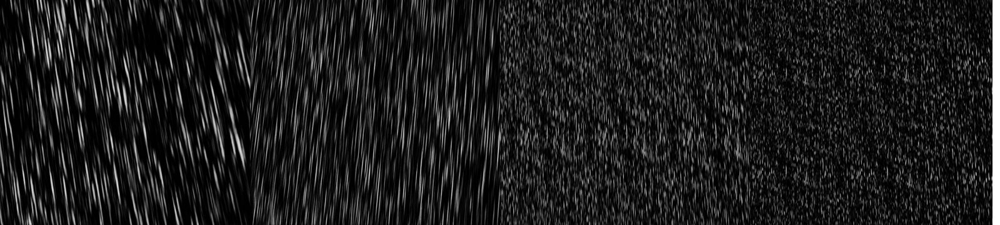

# 简介
游戏中雨水渲染主要就是两种，第一种就是使用粒子模拟，通过物理碰撞实现水花的检测，这个方案主要就是更加真实，实现也比较简单，但是雨的密度提不上去，因为这里有很大的CPU消耗。第二种方案就是使用全屏面片表示，这样就没有雨水密度的限制，性能上也比较有优势，但是实现可能会稍微麻烦一点，需要有高度图（离线生成或实时生成）。下面主要是关于第二种方案的实现。

# 实现
以下内容参考自文章[Water drop](https://seblagarde.wordpress.com/2012/12/27/water-drop-2a-dynamic-rain-and-its-effects/)。Sébastien Lagarde大佬的博客有很多的干活，领导寒霜引擎引入PBR管线。
## 水花（Splash）
在地面上模拟水花可以通过碰撞检测，但是这里使用高度图在地面上随机生成水花点，高度图可以实时生成，比如在人物周围生成一张256x256的深度图，或者离线生成一张非常大的深度图，在手游上可能预先生成一张比较合适，或者在游戏开始的时候渲染一张高度图，这样可以减少包体大小。水花这里使用贴花来表示，并使用滚动的水花图，这里渲染水花的步骤：
 * 渲染深度图
 * 深度图回读到CPU
 * 在CPU端通过高度图随机生成水花点
 * 在目的点生成水花

## 雨滴（Raindrops）
雨滴渲染是其中最为麻烦的一部分，首先雨比较难观察到，在大雨和良好照明条件下才比较明显，雨一般呈现为一条条细线，实际上也是单个雨滴。而且雨水在不同亮度下的表现也不一样，如果光线比较亮就不明显，但是在稍微暗点的情况下与比较明显。
 * 雨滴以165°的大夹角将光折射到相机，所以雨滴一般会比场景更亮点
 * 雨滴所遮挡的立体角背面远小于水滴所占的视野，所以尽管是透明的，但是其亮度并不是很依赖于环境
 * 雨滴的亮度不会受到其他雨滴的影响，这是因为对于任意给定的雨滴，其他雨滴对影响当前雨滴立体角来说太小，所以亮度影响也无关紧要。

正确的雨滴渲染需要据偶反射、折射和内部反射。所以雨水的表现受很多因素影响，光源、观察方向、到相机的距离、雨滴大小甚至相机曝光时间。在渲染远距离雨水的时候可以不用考虑光源等因素的影响，但是在渲染近距离的雨滴的时候就不能紧紧考虑这些。

可以使两个锥形网格组成模型倾斜来表示雨的倾斜，从而指向相机，并按比例缩小四个连续纹理并且滚的更慢，从而模拟出更小的雨滴并且能够移动的更慢，这样就可以模拟出视差深度。如下图：

这里作者定义了4层在相机前面，表示远近，如下图：

每一层用的是同一张雨滴图，通过缩放UV和改变速度来表示每一层雨滴情况，这样做就会有层次感。不过这里远处的层可能会有
明显的Tiling，这里可以考虑加入噪声扰动。

# UE4实现
## 绘制深度图
得到高度图有好几个方案，各有利弊：
1. 预计算一张比较大的深度图，优点是不消耗运行期性能，缺点也比较明显，可能精度不太够。实测在2kmx2km的地图下，2048x2048的深度图够用。
2. 实时计算一段比较小范围的深度图，比如玩家周围20m，256x256，优点是比较灵活，甚至可以支持动态物体的深度，但是会消耗一定的性能，毕竟是实时计算。
3. 在运行期计算一张比较大的贴图，如2048x2048表示200mx200m区域，但不是实时计算，因为表示区域比较大，在玩家接近边缘区域的时候再更新，而且还可以分帧绘制，从里向外画，就是先从玩家中心开始绘制，下一帧再向外扩，这样可以减少GPU压力，优点是比较灵活，随然没第二种方案灵活但是性能更佳，可能对帧数没有实质性的影响，毕竟200m的范围玩家要活动一段时间才能出去，缺点也比较明显，就是实现起来比较麻烦。

最终实现还是使用预先计算好的深度图，这里加了一个单独的Pass渲染雨水深度（TRainDepthVS, TRainDepthPS），不过这个Pass的Shader只在Editor模式下编译，打包后没有（RainDepthRendering.cpp），生成的Depth如下：

## 雨滴图
雨滴图用一张贴图表示，两个通道分别表示雨滴的亮度值（可以通过调整亮度阈值来决定雨的密度）和雨滴的深度值（0-1），这个图可以是程序化生成或者美术生成（目前提供了自动生成的功能），如下图：
亮度图：

深度图：

URainDepthComponent：该组件就是绘制雨水深度的组件，需要拖到场景里，相当于逻辑线程对渲染线程的RainDepthRendering的代理

## 渲染雨滴
雨滴的渲染主要有以下几个步骤：
1. 需要一个双锥形的模型，相机在模型原点，模型正常是对向雨的方向
2. 对雨进行分层，雨水渲染需要多层，所以需要在相机前按距离划分多层，每层需要渲染对应雨滴
3. 每一层渲染雨滴，通过滚动雨滴贴图来表示雨的下落
4. 处理雨滴的遮挡关系，需要对每层进行判断，根据深度可以获取到实际位置，那么配合之前生成的深度图，可以决定是否被遮挡
5. 雨密度表示，一般就是调整alpha值来表示雨大雨小，这样雨密度就完全与性能消耗无关

这里的双锥模型用的是ProceduralMesh生成的，渲染是用的UE4 unlit半透明材质（MT_RainCone）

## 渲染水花
目前方案就是预先生成一组二维水花位置，这些信息存在Vertex中，除了有位置信息，还有就是每个水花滚动起始时间，因为水花是用滚动贴图的方式实现（滚动图包括开始到结束）。这些信息在经过VS（使用之前生成高度图）后就会在场景中对应位置生成水花quad。这也意味着如果人不动，水花就会在固定位置轮播，正常情况下不会察觉，如果要随机就比较麻烦，需要CPU向GPU写数据，如果数目比较大（例如6000个）那么最起码就要6000个位置信息和当前水花动画时间，CPU也需要维护这些数据，这些消耗在手机上不太合适。

## 使用方式
1. 场景放入RainDepthCapture Actor并调整拍摄深度的方向

    

2. 点击SaveDepthTexture会生成深度图（这里可能需要重启项目）

    

2. 放入RainRenderingCone Actor

    

4. 经过上面的步骤场景就已经可以渲染出雨水了，效果如下：

    

