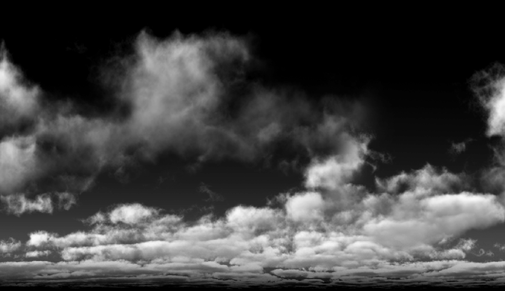

## Sky Dome
要配合TOD的光照，天空球也需要有动态光照效果，常规有几种做法：
* 体积云
* 预先烘焙云在几个方向的光照结果，Runtime插值，可以用Houdini做

这里参考天刀的做法，比较简单，直接对一张图处理就行，大致做法是根据美术做好的一张云的图片，然后对三个方向做径向模糊，这样就可以在runtime得到不同方向光照影响的范围，这里的径向模糊可以自动生成（详细见CloudMapGenerateor），下图：

* 云原图

* R通道偏移

* G通道偏移

* B通道偏移

* 有了这三个偏移就可以在Runtime根据像素点与太阳的相对位置计算受光照影响的结果，不同主光方向的结果如下：

材质名：MT_Cloud_TOD

## 云海渲染
云海渲染主要还是常规的渲染方式，就是一张的云基本形状的3DTexture和Noise的3DTexture

### 形状
形状部分就是根据云的3DTexture叠加上Noise生成的分形噪声，这就有了基本的形状

### 光照
光照部分主要有两部分：
* 视线方向云产生的衰减
    * 光的衰减部分可以用距离场来减少RayMarch次数  
* 光源对云光照的贡献，这里就使用常规的HG Phase Function
    * 正常来说每个点还需要对光源方向做一次RayMarch，这里可以预先把衰减值存在3DTexture里做近似的衰减效果，更精确一点的可以存几个方向的衰减值，或者用球谐表示一个点的衰减值

正常RayMarch必定会产生分层的请况，这里可以用蓝噪声给RayMarch加一个偏移距离

### 渲染结果
